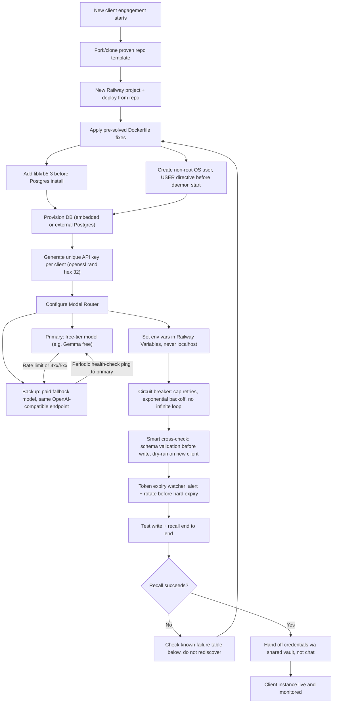

# Proven Client Architecture Checklist — Reusable Build Playbook

**Source of truth:** derived from the avibe-hindsight Railway deployment (Aug 15, 2026) — every fix below was already discovered once, at real cost. This document exists so no future agent or session rediscovers the same bugs.

**Scope:** applies to any self-hosted memory/agent service deployed on Railway (Hindsight for Elisa, or any future client instance), not just LexFlow itself.

---

## Workflow Diagram



*(This diagram is Mermaid syntax — Obsidian renders it natively. No external image needed.)*

---

## 1. Dockerfile Fixes (solved once — apply directly, don't debug from scratch)

### Fix A — Missing `libgssapi_krb5.so.2`

**Symptom:** Postgres client tools fail to load at container startup with a "cannot load library" error.
**Cause:** Base container image lacks the GSSAPI/Kerberos shared library that Postgres client libraries link against.
**Fix — add before any Postgres install step:**
```dockerfile
RUN apt-get update && apt-get install -y libkrb5-3 && rm -rf /var/lib/apt/lists/*
```
If `libkrb5-3` alone doesn't resolve it on a different base image, try `krb5-user` or `libgssapi-krb5-2` as fallback package names (Debian vs. Ubuntu vs. Alpine naming differs).

### Fix B — Postgres refuses to start as root

**Symptom:** `Postgres fails: 'cannot be run as root'`
**Cause:** Railway containers default to root; Postgres has a built-in safety refusal to run as root.
**Fix:** create a dedicated OS user and switch to it with a `USER` directive *before* the daemon/initdb step:
```dockerfile
RUN useradd -m -s /bin/bash pguser
USER pguser
```

---

## 2. Model Router — Free-Tier Primary + Paid Backup + Auto-Recovery

**Problem this solves:** relying on a single free-tier model with no fallback means the whole service goes down the moment that model hits rate limits, gets deprecated, or the provider has an outage.

**Pattern:**
1. **Primary:** free-tier model (e.g. `google/gemma-4-31b-it:free` via OpenRouter) — used by default for cost.
2. **Backup:** a paid fallback model on the *same* OpenAI-compatible endpoint, so no code path changes, only the model name in the request.
3. **Failover trigger:** any 429 (rate limit), 5xx, or malformed response from primary → immediately retry once against backup, log the failover event.
4. **Auto-recovery:** a periodic health-check (e.g. every 15 min) pings the primary model with a trivial request; if it succeeds twice in a row, route new requests back to primary automatically. Never require a manual flip back.
5. **Never hardcode `localhost`** as the model base URL in any cloud deployment — that only resolves on your own machine, not inside Railway's container.

```bash
HINDSIGHT_API_LLM_BASE_URL=https://openrouter.ai/api/v1
HINDSIGHT_API_LLM_PROVIDER=openai
HINDSIGHT_API_LLM_MODEL=google/gemma-4-31b-it:free
# Backup model swapped in only on failover, same base URL/provider shape
```

OpenRouter natively supports a `provider` routing object in the request body that can express this primary→fallback chain without custom code — configure the fallback list directly in the model config rather than writing manual retry logic where avoidable.

---

## 3. API Token Expiration — Don't Get Silently Locked Out

- Every issued key (Hindsight API key, OpenRouter key, any per-client secret) gets a **hard expiration date** tracked in the credentials sheet, not left open-ended.
- Set an **alert 7 days before expiry** — renewal requires explicit re-approval, never silent auto-continuation (this mirrors the same rule already applied to Elisa's access keys).
- Store all keys in a secrets manager or password vault (1Password/Bitwarden shared vault) — **never** in chat, commits, or code.
- Rotate, don't reuse: generate a fresh key per client with `openssl rand -hex 32` — never share one key across multiple client instances.

---

## 4. Circuit Breaker — Preventing Endless Loops & Congestion

- Cap retries at a fixed number (e.g. 3) with **exponential backoff** (1s → 2s → 4s), never an unbounded while-loop.
- If a request fails after max retries, **fail loudly** (log + alert) rather than silently queuing indefinitely — a silently growing queue is how congestion turns into an outage.
- Any background job (memory extraction, sync task) must have a hard timeout; a hung job should self-terminate and log, not block the queue for everything behind it.
- Rate-limit awareness: track free-tier limits explicitly (e.g. "20 requests/minute, 200/day") and throttle proactively before hitting the provider's own 429, rather than reacting after the fact.

---

## 5. Smart Cross-Checks — Catch Problems Before They Compound

- **Schema validation before write:** confirm the request body shape matches the target API's current schema (check the live `/docs` endpoint on each deployment — schemas can drift between versions) before sending, not after a failed write.
- **Dry-run on every new client setup:** before connecting real data, run one test write + one test recall and confirm both succeed end-to-end. Do not consider a new client instance "live" until this passes.
- **Known-failure table lookup first:** before debugging a new-looking error, check the table below — most failures in this category are already solved and documented, not novel.

---

## 6. Known Failure Table (check here before debugging blind)

| Symptom | Root Cause | Fix |
|---|---|---|
| Postgres fails: "cannot be run as root" | Railway containers default to root | Add non-root user in Dockerfile before `initdb` runs |
| Postgres fails: missing `libgssapi_krb5.so.2` | Bundled Postgres binary missing system lib | `apt-get install -y libkrb5-3` before Postgres install |
| LLM call returns 405 on `/v1/chat/completions` | Provider endpoint shape mismatch (e.g. Ollama Cloud vs. OpenAI format) | Switch to an OpenAI-compatible provider (e.g. OpenRouter) |
| LLM connection refused / timeout | Base URL still pointing to `localhost:11434` | Point `BASE_URL` at the cloud provider's endpoint, never localhost, on any cloud deployment |
| API POST returns "Field required: items" | Wrong request body shape (bare `content` vs. `items` array) | Wrap payload as `{"items": [{"content": "..."}]}` — verify against live `/docs` |

---

## 7. Rebuild Checklist — New Client/Instance (~40 min total)

| # | Task | Est. Time |
|---|---|---|
| 1 | Fork/clone proven repo template | 5 min |
| 2 | Create new Railway project, deploy from repo | 10 min |
| 3 | Provision DB (non-root Dockerfile fix already inherited) | 0 min |
| 4 | Generate new unique API key (`openssl rand -hex 32`) | 2 min |
| 5 | Configure Model Router: primary + backup + failover | 5 min |
| 6 | Set env vars in Railway Variables (never localhost) | 5 min |
| 7 | Assign unique instance/bank identifier | 1 min |
| 8 | Connect client agent(s) — confirm mode matches architecture | 10 min |
| 9 | Run dry-run: test write + recall end-to-end | 5 min |
| 10 | Hand off credentials via shared vault (1Password/Bitwarden), never chat/email | 5 min |

---

## What NOT to Do

- ❌ Do not use a different identifier/bank ID per device for the same shared instance — breaks the "one brain" goal silently.
- ❌ Do not regenerate a shared API key per device — reuse the same one across devices for the *same* client, but never share one key across *different* clients.
- ❌ Do not point any deployment at `localhost` — the server lives on Railway, not on any single machine.
- ❌ Do not let a free-tier model be the only path with no backup — always configure primary + backup + auto-recovery per Section 2.
- ❌ Do not let retries loop unbounded — always cap + backoff per Section 4.

---

*This document is a living reference — update the Known Failure Table whenever a new bug is solved, so it is never rediscovered.*
