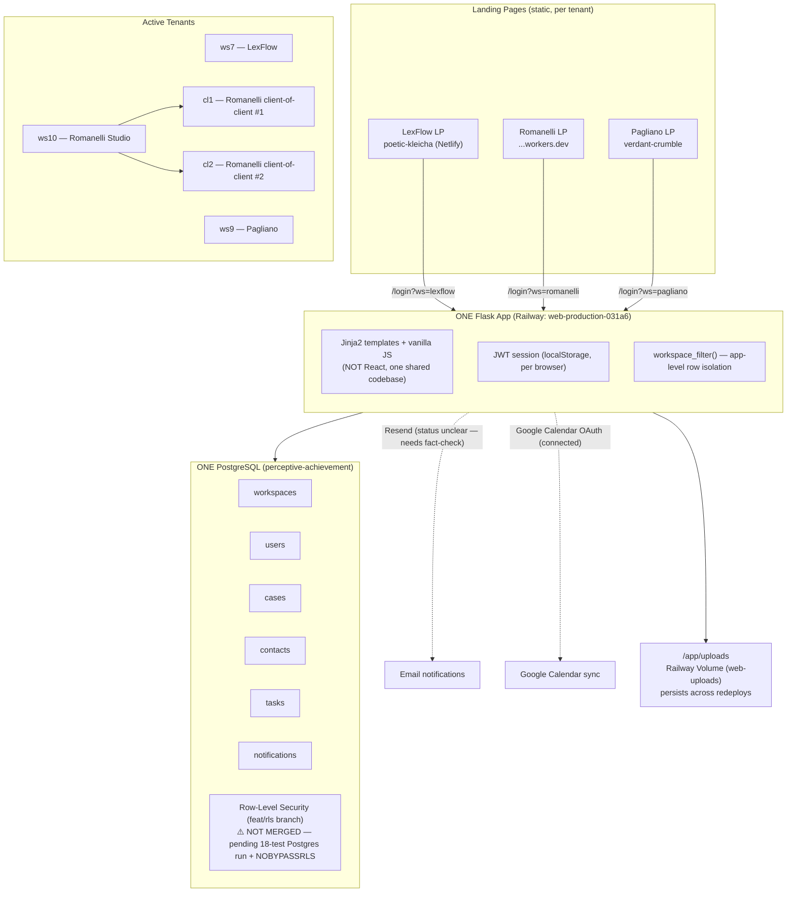
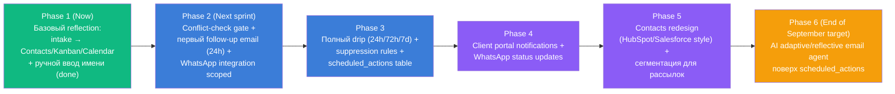
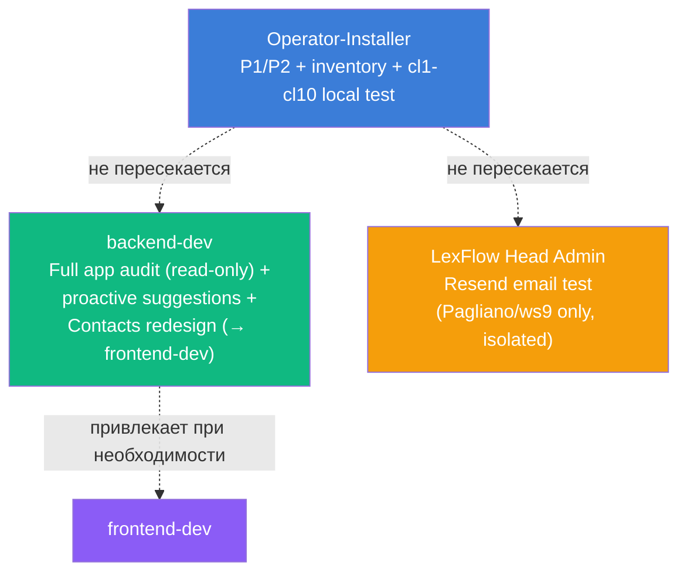

# LexFlow — Architecture (Current) & Automation Roadmap

> Открывай в VS Code / Obsidian / GitHub — диаграммы Mermaid рендерятся автоматически как визуальные схемы.

## 1. Текущая архитектура (as of Sept 3, 2026)

### Известные разрывы / открытые вопросы
- RLS построен на `feat/rls`, но не влит — защита изоляции только на уровне приложения (`workspace_filter()`), без резервного слоя в БД.
- Webhook-дыра закрыта (commit a2781f5) — подпись теперь обязательна, workspace_id больше не NULL.
- Resend/email интеграция: точный статус (Railway vs отдельный проект) — ожидает подтверждения от Operator-Installer.
- Uploads volume: `web-uploads`, mount `/app/uploads`, план подтверждён, ожидает финального go на редеплой.

---

## 2. Roadmap автоматизации (инкрементально, без "скачков")

### Технический выбор по типу задачи

| Тип задачи | Модель триггера | Технология | Когда апгрейдить |
|---|---|---|---|
| Мгновенное письмо-подтверждение | Event-driven (instant) | Прямой вызов Resend API в handler'е | Не требуется |
| Отложенный follow-up (24ч/72ч/7д) | Event-driven + delay | Postgres `scheduled_actions` + Railway worker (MVP) → Celery+Redis (масштаб) | При >500 задач/день или нужны retries |
| Напоминания о слушаниях | Time-based (cron) | Railway worker, ежедневный скан дат | Не требуется — cron корректен здесь |
| WhatsApp-уведомления | Event-driven | WhatsApp Business API (Twilio/Meta Cloud API) | Новая интеграция |
| AI adaptive follow-up | Event-driven + AI decision layer | AI-агент читает activity_log + notifications | Строить после Phase 3 |

---

## 3. Параллельные треки (текущий спринт)

