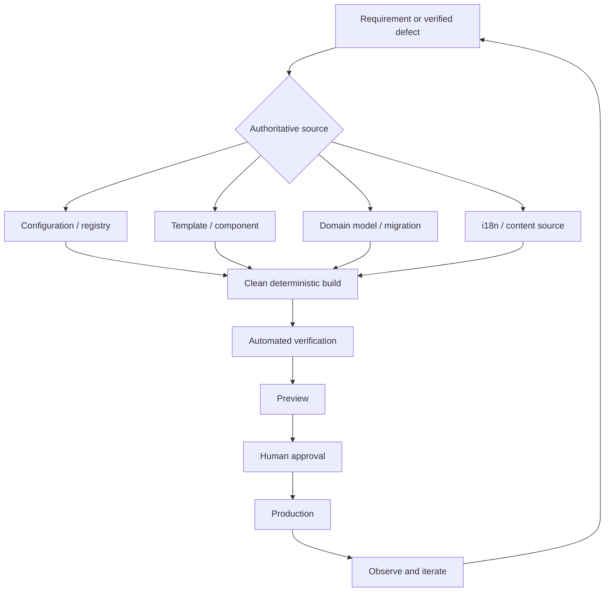
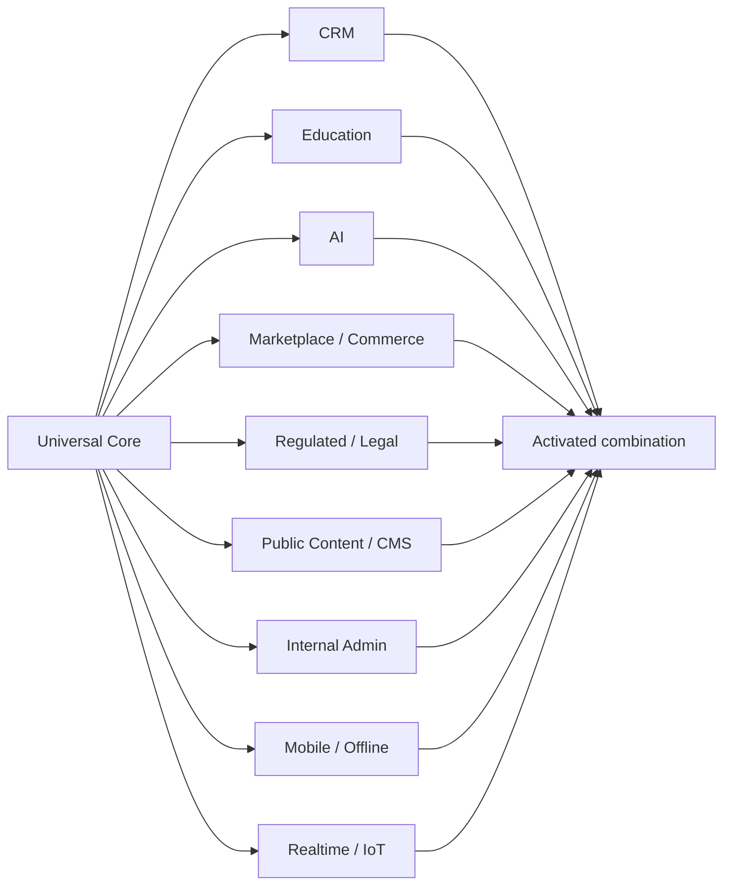
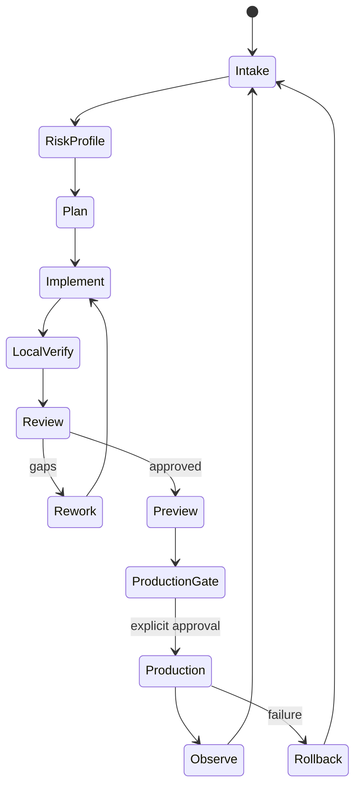
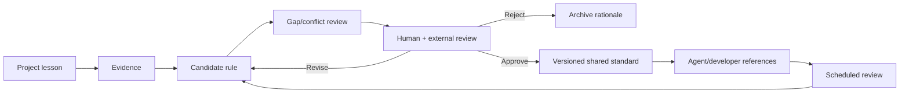

# Candidate Universal Hard Rules for AI-Assisted Full-Stack Development

**Status:** Candidate only — not adopted  
**Version:** Draft 0.1 — 2026-09-16  
**Audience:** Hermes development agents, AI-assisted developers, reviewers, product owners, and non-technical builders  
**Scope:** Web, mobile, SaaS, CRM, EdTech, marketplaces, e-commerce, portals, CMS, internal tools, API products, AI-enabled and regulated applications  
**Permanent standards modified:** No  
**Approval required before adoption:** Yes

## Purpose

This candidate defines one universal engineering core plus composable application profiles. A CRM, learning platform, marketplace, mobile application, or AI service should share the same safety and quality foundation without being forced into the same architecture.

Security must be integrated into the chosen SDLC rather than left for a final audit; NIST SSDF is explicitly designed as a core set of practices that can be incorporated into different lifecycle models.[cite:157][cite:170] Accessibility should target WCAG 2.2, while privacy and AI risk should be managed throughout the product lifecycle.[cite:172][cite:173][cite:202]

Requirement levels:

- **MUST:** Release-blocking hard rule unless a documented exception is approved.
- **SHOULD:** Default rule; deviation requires rationale and verification.
- **MAY:** Optional pattern selected when it fits the product.
- **PROFILE:** Additional requirements activated by capability, risk, data, users, or regulation.

## Governing principle

> **Change the authoritative source, not its generated consequence. Build every product so it remains safe to change after launch.**

The less changeable information is hard-coded across a codebase, the better. Stable invariants may live in code. Domains, secrets, environment URLs, CTA targets, routes, feature flags, asset assignments, role permissions, locale mappings, legal entity data, limits, and relationships must live in the correct centralized source.

## Universal hard rules

### HR-01 — Authoritative source first

**MUST:** Every durable change is applied at the highest authoritative editable layer: domain model, migration, configuration, registry, content/i18n source, component, template, infrastructure definition, or build script.

Generated HTML, compiled bundles, `dist/`, caches, deployment artefacts, and vendored files are never permanent editing layers. A diagnostic direct edit must be labelled, reproduced in source, rebuilt, verified, and discarded.

### HR-02 — One source of truth

**MUST:** Every changeable concern has one declared owner and one authoritative source. Routes, permissions, schema, copy, translations, assets, integrations, plans, prices, and legal identity must not have competing authorities.

Generated copies, caches, indexes, and read models are replaceable derivatives. Conflict resolution must be explicit.

### HR-03 — Post-launch evolvability

**MUST:** The first production release is version one, not a frozen artefact. Routes, workflows, roles, fields, integrations, copy, languages, assets, policies, and data models must remain centrally changeable without mass manual editing.

Renaming, splitting, merging, or retiring a page/API updates dependent navigation, links, clients, metadata, compatibility routes, redirects, and tests together.

### HR-04 — Configuration outside code

**MUST:** Environment-specific values and secrets stay outside source code. Required configuration is validated at startup/build and fails closed when absent. No production fallback may silently use a placeholder, preview host, sample tenant, or development database.

### HR-05 — Explicit architecture boundaries

**MUST:** Identify presentation, application/service, domain, data, integration, and infrastructure boundaries. UI is not the sole home of business rules; transport handlers do not bypass authorization; persistence models do not silently define the public API.

**SHOULD:** Use the simplest architecture that preserves these boundaries. Prefer a modular monolith over premature microservices.

### HR-06 — Contract-first integrations

**MUST:** Every external/cross-module integration has a versioned contract: endpoint, authentication, schemas, errors, timeout, retries, idempotency, ownership, and deprecation.

APIs require object-level and function-level authorization, resource limits, inventory, and safe processing of third-party responses.[cite:194][cite:197]

### HR-07 — Versioned database migrations

**MUST:** Persistent schema changes use reviewable migrations. Destructive changes require backup/restore evidence, compatibility sequencing, and rollback or roll-forward planning. Manual production edits are prohibited except under an approved incident procedure later captured as a migration.

### HR-08 — Data lifecycle ownership

**MUST:** Every sensitive field has an owner, purpose, retention, deletion/export behavior, access policy, and backup treatment. Data protection by design/default is applied before and during processing and reviewed over time.[cite:207]

### HR-09 — Deny by default

**MUST:** Authentication and authorization remain separate. Backend controls enforce tenant, role, object, field, and action permissions regardless of UI visibility. New resources and operations default to denied.

### HR-10 — Secure by design/default

**MUST:** Threat modelling and abuse-case review precede sensitive implementation. Security is a core product requirement, not a later add-on.[cite:159][cite:166]

**MUST:** Use OWASP ASVS as the risk-appropriate, verifiable application-security baseline; OWASP identifies ASVS 5.0.0 as the current stable release.[cite:158][cite:162]

### HR-11 — Secret safety

**MUST:** Secrets and unredacted personal data never appear in prompts, chat, source control, client bundles, screenshots, fixtures, or normal logs. Suspected exposure triggers rotation, not mere deletion. Secret scanning runs before commit and in CI.

### HR-12 — Dependency and supply-chain control

**MUST:** Dependencies are lockfile-controlled, attributable, scanned, and reviewed. Releases record source commit and dependency state. OWASP SCVS covers inventory, SBOM, build environment, package management, component analysis, and provenance; SLSA provides incremental build-integrity controls.[cite:184][cite:219]

**SHOULD:** Produce an SBOM and build provenance.

### HR-13 — Deterministic clean builds

**MUST:** Build output is reproducible from declared source/configuration. The output directory is deleted and recreated so stale files cannot survive. Only an allowlisted artefact is deployable.

### HR-14 — Isolated change workflow

**MUST:** Agents work in isolated branches/workspaces and do not push, merge, deploy, create infrastructure, or alter permanent standards without explicit permission.[cite:150][cite:152]

### HR-15 — Risk-based testing

**MUST:** Use unit tests for domain behavior, integration tests for boundaries, contract tests for APIs, and end-to-end tests for critical journeys. Defect fixes receive regression tests when practical. Failure, permissions, loading/empty/error, retry, responsive, and locale states are tested as applicable.

### HR-16 — Honest validation scope

**MUST:** Test reports state denominator and exclusions. “25/25 passed” is invalid as completeness proof when 49 deployable pages exist. Generated locale/tenant/role/theme/plan combinations are tested according to risk; high-risk access boundaries receive exhaustive automated coverage.

### HR-17 — Accessibility by default

**MUST:** User-facing products target WCAG 2.2 AA unless stricter obligations apply.[cite:172] Semantic structure, keyboard operation, focus, names, errors, reflow, zoom, contrast, target size, reduced motion, captions/transcripts, and assistive-technology checks are definition-of-done requirements.

### HR-18 — Performance budgets

**MUST:** Define budgets for client JS, images, fonts, API latency, database queries, AI calls, and critical journeys. For web, target LCP within 2.5 seconds, INP at or below 200 ms, and CLS at or below 0.1 at the 75th percentile for mobile and desktop.[cite:204][cite:208]

### HR-19 — Observability

**MUST:** Production exposes structured logs, metrics, traces, health signals, and audit events sufficient to identify failure, impact, start time, release, and recovery. OpenTelemetry is a vendor-neutral framework for traces, metrics, and logs.[cite:218][cite:225] Telemetry must not leak secrets or unnecessary personal data.

### HR-20 — Safe release and rollback

**MUST:** Preview/staging and production are explicit and separate. Every release identifies source commit, build, configuration class, migrations, checks, approver, and target. Define rollback/roll-forward before production; feature flags require owners, secure defaults, expiry, and cleanup.

### HR-21 — Restore-tested backups

**MUST:** A backup is not accepted until restoration has been tested. Define RPO/RTO and test data, files, encryption dependencies, configuration, and tenant boundaries.

### HR-22 — Idempotent side effects

**MUST:** Payments, email, webhooks, document generation, enrolment, imports, scheduled jobs, and external writes define duplicate handling, bounded retries, timeouts, idempotency, and recovery. Incoming webhooks are authenticated where supported and traceable.

### HR-23 — Explicit state machines

**MUST:** Multi-step workflows use declared states/transitions, not scattered booleans. Transition logic belongs in a domain/application layer, checks authorization, and emits audit events for sensitive changes.

### HR-24 — Human-centred error recovery

**MUST:** Critical flows preserve work where safe, explain failures plainly, distinguish validation from system errors, and offer next steps. No stack traces, model prompts, database errors, or security internals reach users.

### HR-25 — Internationalization as architecture

**MUST:** Locales share stable content, route, and translation IDs. Generated translations do not become independent hand-edited forks. Check missing keys, links, metadata, formats, legal text, layout expansion, and language-switch destinations. High-impact/legal copy requires human review.

### HR-26 — AI agent change discipline

**MUST:** AI output is an untrusted proposal until reviewed and verified. Agents cannot claim a test, visual check, security fix, or deployment without evidence. Prompts define scope, prohibited actions, authoritative sources, verification, and stop conditions.

### HR-27 — AI feature safety

**PROFILE—AI:** Address prompt injection, sensitive-information disclosure, excessive agency, supply chain, data/model poisoning, unbounded consumption, misinformation, hidden-context exposure, vector/embedding weaknesses, and improper output handling.[cite:198]

**MUST:** AI affecting rights, money, legal position, health, grades, access, publication, or deletion has proportional human oversight, provenance, uncertainty communication, and reversible action. NIST AI RMF integrates trustworthiness into design, development, use, and evaluation.[cite:202][cite:205]

### HR-28 — Living documentation

**MUST:** The repository documents setup, architecture, configuration, data, deployment, migrations, integrations, testing, recovery, and incidents. It marks source versus generated outputs. A rule living only in chat or one agent’s memory is not operational.

### HR-29 — Decisions and exceptions

**MUST:** Significant decisions and exceptions record context, decision, alternatives, trade-offs, owner, review/expiry, and evidence. An exception cannot silently become precedent.

### HR-30 — Human approval gates

**MUST:** Human approval precedes production deploy, destructive migration/deletion, external publication, billing activation, credential rotation, non-preauthorized push/remote operations, and shared-standard modification. A project lesson becomes universal only after review of evidence, generality, cost, exceptions, and conflicts.[cite:150]

## Advisory rules

- **AR-01 — Boring, reversible technology:** Prefer mature, simple tools; justify complexity.
- **AR-02 — Modular monolith first:** Introduce services only for evidenced scaling, isolation, ownership, regulation, or deployment needs.
- **AR-03 — Progressive disclosure:** Keep common paths simple while preserving advanced professional control.
- **AR-04 — Design system before page exceptions:** Use tokens/components/state patterns; name and justify exceptions.
- **AR-05 — Stable IDs over labels:** Renaming/translating display text must not break data or integrations.
- **AR-06 — Capability-based profiles:** Activate profiles by actual capability/risk, not product marketing category.
- **AR-07 — Outcome analytics:** Collect metrics tied to decisions and user outcomes; minimize and govern analytics data.
- **AR-08 — Cost as quality:** Track AI tokens, storage, egress, messages, third-party calls, and database growth.
- **AR-09 — Graceful degradation:** Critical content/workflows remain usable when optional JS, AI, analytics, or widgets fail.
- **AR-10 — Sunset temporary mechanisms:** Flags, adapters, compatibility routes, preview hosts, and test accounts need owners and removal criteria.

## Composable profiles

### CRM profile

**MUST:**

- Enforce and test tenant isolation at API and data layers.
- Model lifecycle states/transitions explicitly.
- Keep immutable audit history for sensitive fields, assignment, stage, consent, and permission changes.
- Define deduplication/merge without silently losing history.
- Make custom fields schema-driven, validated, permission-aware, searchable where needed, and migration-safe.
- Separate role permissions from UI visibility.
- Give imports/exports mappings, dry-run validation, partial-failure handling, and rollback.
- Version webhook/integration contracts with idempotency/replay controls.
- Define retention/deletion across records, messages, files, activities, backups, and integrations.
- Decouple public website CTAs from internal superadmin routes.

**SHOULD:** Preserve provenance of human, import, integration, automation, and AI-authored field values; provide saved views, bulk previews, undo where feasible, and timezone-safe SLA automation.

### Education and learning profile

**MUST:**

- Define measurable learning outcomes before content and gamification.
- Keep completion, mastery, attendance, engagement, and assessment distinct.
- Version courses, lessons, rubrics, questions, and certificates.
- Preserve or deliberately migrate progress when content changes.
- Provide accessible alternatives for media, drag-and-drop, timed tasks, charts, and exercises.
- Define academic-integrity, permitted AI assistance, authorship, and appeal paths.
- Apply age-appropriate consent/safeguards where minors may participate.
- Validate AI-generated learning content for accuracy, bias, age fit, pedagogy, privacy, and foreseeable harm; UNESCO recommends human-centred, age-appropriate and ethically validated use.[cite:234][cite:238]
- Keep consequential grading and learner decisions human-reviewable.

**SHOULD:** Use LTI 1.3 for standardized LMS/tool integrations and xAPI where interoperable learning-activity records are needed.[cite:232][cite:233] Support low bandwidth, resumability, transparent progress, and context-sensitive AI literacy.[cite:189][cite:193]

### Marketplace and commerce profile

**MUST:** Use explicit currency and integer minor units/appropriate decimals; preserve price/tax/fee/discount/refund provenance; make payments, stock, refunds, and fulfilment idempotent; separate actor permissions; model disputes/chargebacks/reconciliation; never trust client-side prices or entitlements.

### Public website/CMS profile

**MUST:** Centralize route, content, asset, locale, redirect, and metadata models; generate canonical/hreflang/sitemap/schema/social metadata/internal links from the same page model; preserve moved URLs; prevent orphans; test every deployed page; retain replaceable master assets and optimized derivatives; noindex previews; never permanently edit generated output.

### Internal admin profile

**MUST:** Strong authentication and least privilege; step-up protection for bulk, impersonation, export, role, deletion, and configuration actions; attributable audit logs; visible/bounded impersonation; no security-by-obscurity.

### Regulated/legal/health profile

**MUST:** Data classification, accountable decisions, auditability, retention, legal review, and escalation before launch; human responsibility for consequential advice; separate source evidence, AI interpretation, professional approval, and external output; preserve chain of custody where relevant; legal placeholders block production.

### Mobile/offline profile

**MUST:** Define sync ownership, conflicts, retry, local encryption, logout cleanup, and revocation; assume interrupted networks, duplicate submission, clock differences, and partial sync; support platform accessibility; never store unrestricted sensitive datasets or long-lived secrets in clients.

### Realtime/device/IoT profile

**MUST:** Define event ordering, deduplication, time semantics, reconnect, stale-data indicators, command acknowledgement, device authentication/rotation/revocation, and safe failure.

### AI-assisted non-technical builder profile

**MUST:**

- Translate intent into scope, acceptance criteria, risks, and prohibited actions before code.
- Map sources, generated outputs, stores, integrations, environments, and deployment targets.
- Show changed files, commands, tests, failures, and evidence.
- Never accept “looks correct” as security, data, accessibility, migration, or deployment proof.
- Use non-production data/credentials and prevent accidental infrastructure/billing actions.
- Explain migration, deletion, security, cost, lock-in, and rollback in plain language.
- Pause at high-impact gates.

**SHOULD:** Provide important terms in English/Russian/Italian where useful to the learning workflow.[cite:141] Maintain a learning log: concept, example, mistake, fix, reusable rule, and source.

## Activation examples

| Product | Activated baseline | Extra gates |
|---|---|---|
| Legal CRM + website | Universal + CRM + Regulated + Public Content | Tenant isolation, audit, legal copy, secure public-to-CRM integration |
| AI learning platform | Universal + Education + AI + AI-assisted Builder | Pedagogical validation, disclosure, assessment oversight, model-cost limits |
| Learning app for minors | Universal + Education + AI if used + Mobile if applicable | Age/guardian model, minimization, content safety |
| Marketplace | Universal + Marketplace + Public Content | Reconciliation, seller isolation, disputes, abuse controls |
| Internal analytics | Universal + Internal Admin | Field authorization, export controls, freshness, audit |
| Multilingual site | Universal + Public Content | Locale parity, redirects, crawlability, full-link audit |
| Mobile field CRM | Universal + CRM + Mobile | Conflict resolution, device security, sync recovery |
| AI document assistant | Universal + AI + domain profile | Attribution, retrieval isolation, prompt-injection defence, approval |

## Delivery lifecycle

Mandatory gates: intake; risk/profile activation; plan and source map; scoped implementation; clean local verification; evidence review; protected preview; production legal/security/data/recovery approval; operation and learning.

## Agent verification contract

Every completion report states:

- Goal and acceptance criteria.
- Branch/workspace and base commit.
- Authoritative sources and generated outputs changed.
- Files deliberately untouched.
- Commands actually run.
- Tests passed/failed/skipped with denominator.
- Security, privacy, accessibility, performance and profile checks.
- Migration, backup, restore, rollback, preview, production and secrets status.
- Unresolved blockers/trade-offs.
- Confidence backed by evidence.
- Candidate reusable rules proposed.
- Permanent standards modified: yes/no.

## Standards governance

Project lessons are not automatically universal. Candidate rules must be checked against existing standards, product types, operating cost, exceptions, and contradictions. Permanent standards require ownership, versioning, evidence, and explicit approval.

## Glossary

| English | Russian | Italian | Meaning |
|---|---|---|---|
| Source of truth | источник истины | fonte autorevole | Authoritative editable source |
| Generated artefact | сгенерированный артефакт | artefatto generato | Replaceable output from source |
| Build pipeline | конвейер сборки | pipeline di build | Repeatable path from source to deployable output |
| Regression test | регрессионный тест | test di regressione | Prevents a fixed defect returning |
| Rollback | откат | ripristino | Return to a prior safe release/state |
| Idempotency | идемпотентность | idempotenza | Repetition does not duplicate the business effect |
| Least privilege | минимальные привилегии | privilegio minimo | Only required access is granted |
| Threat model | модель угроз | modello delle minacce | Structured analysis of abuse and defences |
| Observability | наблюдаемость | osservabilità | Understanding behavior through telemetry |
| Data minimization | минимизация данных | minimizzazione dei dati | Only necessary data is collected/retained |
| Human-in-the-loop | человек в контуре | supervisione umana | Human control over consequential automation |

## Review before adoption

- Compare against all existing Obsidian/frontend/backend/SEO/AEO/GEO/security/accessibility/deployment/agent rules.
- Remove duplicates and contradictions.
- Test MUST rules on LexFlow and at least one education app.
- Define calibrated exceptions for prototypes, demos, static sites, offline tools, and high-assurance systems.
- Add stack-specific appendices only after technologies are selected.
- Validate Mermaid diagrams in Obsidian and export formats.
- Review terminology with non-technical builders.
- Assign owner, version, cadence, and change procedure.
- Obtain explicit user approval before permanent adoption.

## Unified plan-track-verify-debug table

| Date | Plan | Location (marker/section) | Action taken | Verification | Debug notes / lessons | Status |
|---|---|---|---|---|---|---|
| 2026-09-16 | Define universal core | HR-01–HR-30 | Drafted source, architecture, data, security, delivery, AI and governance rules | Pass — cross-checked against NIST SSDF, OWASP, W3C, NIST Privacy/AI, CISA, SLSA and OpenTelemetry | Existing Hermes/Obsidian rules still need inventory comparison | Done |
| 2026-09-16 | Add broad profiles | Composable profiles | Added CRM, Education, Marketplace, Content, Admin, Regulated, Mobile, Realtime and AI-builder requirements | Pass — activation matrix confirms profiles compose | Jurisdiction-specific laws remain outside this universal baseline | Done |
| 2026-09-16 | Improve comprehension | Diagrams; glossary | Added three Mermaid diagrams and EN/RU/IT glossary | Needs review — render in the target Obsidian environment | Mermaid rendering varies by exporter | Needs review |
| 2026-09-16 | Preserve approval gate | Status; Standards governance | Marked candidate-only; no permanent adoption permitted | Pass — explicit status and gate included | No Obsidian standard modified | Done |
| 2026-09-16 | Validate practical use | Agent verification contract | Defined required evidence package | Needs review — pilot on LexFlow and an EdTech product | Risk-tier calibration likely after pilots | Pending |

## Candidate conclusion

The universal core governs how software is changed, secured, tested, observed, deployed, recovered, and governed. Composable profiles add domain-specific requirements without forking the core.

> **Golden candidate rule:** Change the highest authoritative source; generate replaceable outputs; verify the complete affected system; deploy only traceable artefacts; preserve safe evolution after launch.

This draft is not an adopted hard rule. It must be tested, compared with existing standards, reviewed for omissions and overreach, iterated, and explicitly approved.
