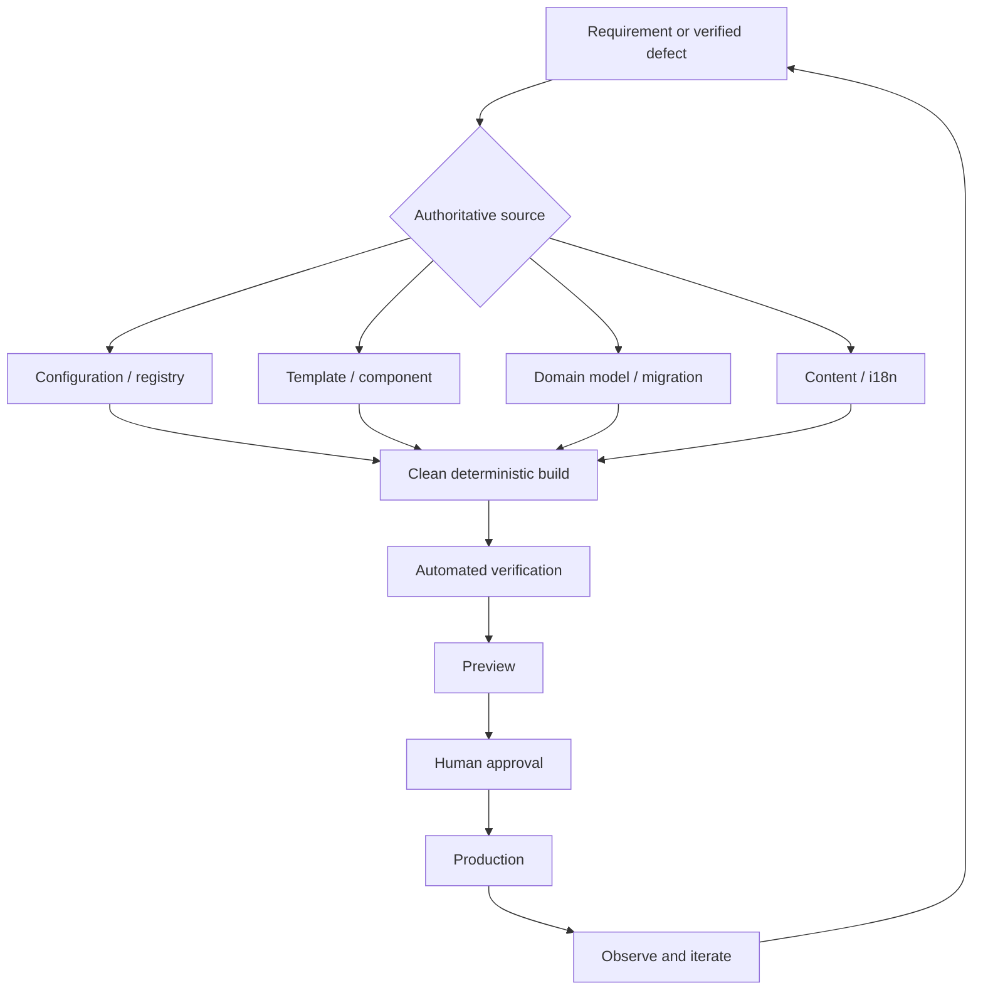
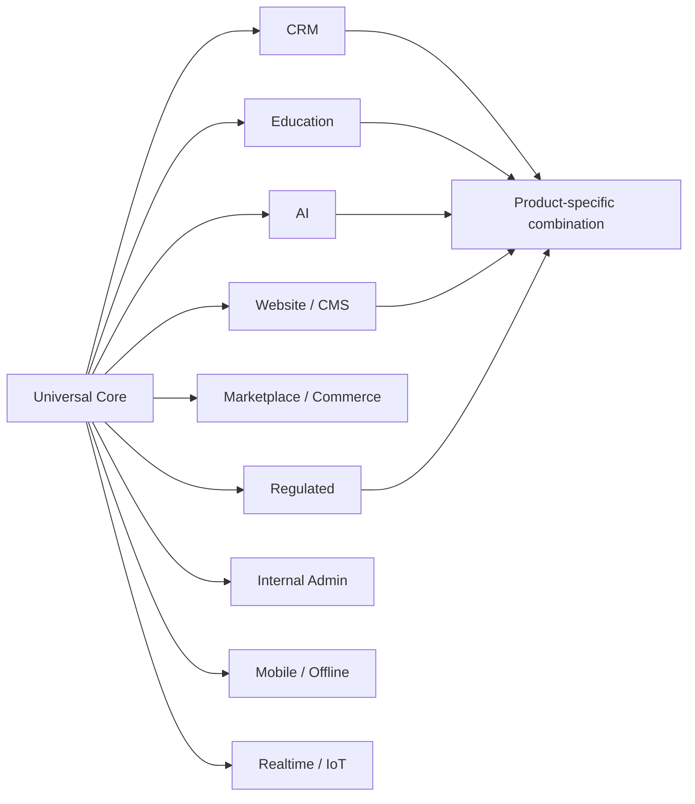
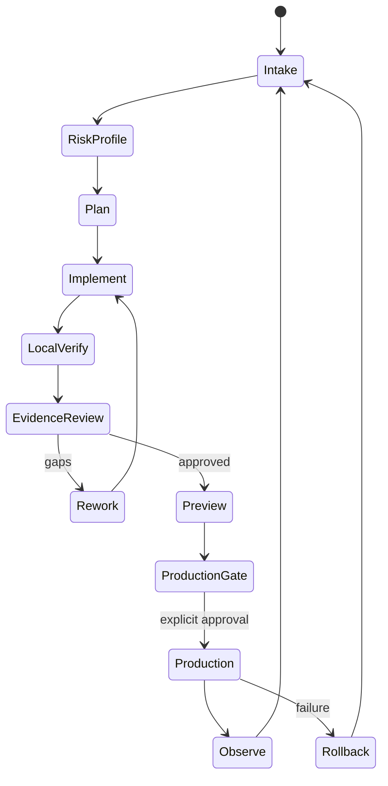
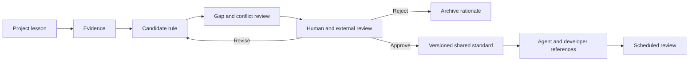

# Candidate Hard Rules for AI-Assisted Full-Stack Development

**Version:** 0.2 — review draft  
**Status:** Candidate only — not adopted  
**Permanent Hermes/Obsidian standards modified:** No  
**Intended readers:** Hermes development agents, human developers, reviewers, product owners, and non-technical AI-assisted builders

## Purpose

This document proposes a common development baseline for websites, SaaS, CRM, EdTech, marketplaces, internal tools, mobile applications, API products, AI applications, and regulated systems. It is deliberately split into a universal core and composable profiles so different products share basic engineering discipline without being forced into identical architectures.

NIST’s Secure Software Development Framework is intended to integrate secure practices into different software-development lifecycles rather than impose one implementation model.[cite:157][cite:170] OWASP ASVS provides verifiable application-security requirements, while W3C recommends WCAG 2.2 for current accessibility work.[cite:158][cite:172]

## Normative terms

- **MUST:** Release-blocking unless a documented exception is approved.
- **SHOULD:** Default practice; deviation requires a written rationale and verification.
- **MAY:** Optional pattern selected when appropriate.
- **PROFILE:** Additional requirement activated by capability, risk, users, data, or regulation.

## Golden rule

> Change the highest authoritative source, generate replaceable outputs, verify the complete affected system, deploy a traceable artefact, and preserve safe evolution after launch.

The fewer changeable values are hard-coded across a system, the better. This does not mean that no value may ever be hard-coded. Stable invariants may remain in code. Domains, secrets, environment URLs, routes, CTA destinations, feature flags, asset assignments, role permissions, locale mappings, legal identity, limits, plans, and product relationships belong in an appropriate centralized source.

## Universal hard rules

### HR-01 — Authoritative source first

Every durable change **MUST** be made at the highest authoritative editable layer: domain model, migration, configuration, registry, content or i18n source, component, template, infrastructure definition, or build script.

Generated HTML, compiled bundles, `dist/`, caches, vendored files, and deployment artefacts **MUST NOT** be permanent editing layers. A direct diagnostic edit is allowed only if it is labelled temporary, reproduced in the authoritative source, rebuilt, verified, and discarded.

### HR-02 — One source of truth

Each changeable concern **MUST** have one authoritative source and one declared owner. Routes, schema, permissions, translations, assets, integration endpoints, prices, plans, and legal identity must not have competing authorities. Generated copies and indexes are acceptable only when they are derived and replaceable.

### HR-03 — Post-launch evolvability

The first production deployment **MUST** be treated as version one, not a frozen artefact. Routes, workflows, fields, roles, integrations, content, languages, assets, policies, and data models must remain centrally changeable without mass manual editing.

Renaming, replacing, splitting, merging, or retiring a page, API, course, workflow, or entity must update its links, navigation, clients, metadata, redirects, compatibility behavior, and tests.

### HR-04 — Configuration outside code

Secrets and environment-specific values **MUST** stay outside source code. Required configuration must be validated at build or startup and fail closed when absent. Production must never silently fall back to a placeholder domain, preview host, sample tenant, or development database.

### HR-05 — Explicit architectural boundaries

Presentation, application/service, domain, persistence, integration, and infrastructure responsibilities **MUST** be identifiable. UI visibility does not replace backend authorization. Persistence models do not automatically define public API contracts.

A modular monolith **SHOULD** be preferred over premature microservices unless independent scaling, isolation, ownership, regulation, or deployment requirements justify distribution.

### HR-06 — Contract-first integrations

Every external integration **MUST** define endpoint, authentication, schemas, errors, timeout, retry, idempotency, ownership, versioning, and deprecation. OWASP’s API guidance highlights object- and function-level authorization, authentication, resource limits, API inventory, and safe consumption of third-party APIs.[cite:187][cite:190]

### HR-07 — Versioned migrations

Persistent schema changes **MUST** use reviewable migrations. Destructive changes require compatibility sequencing, backup-and-restore evidence, and rollback or roll-forward planning. Emergency manual changes must later be captured as migrations.

### HR-08 — Data lifecycle ownership

Sensitive and business-critical data **MUST** have a purpose, owner, access policy, retention period, deletion and export behavior, and backup treatment. Privacy safeguards must be applied before and during processing in accordance with data protection by design and by default.[cite:203][cite:207]

### HR-09 — Deny by default

Authentication and authorization **MUST** remain separate. Backend controls enforce tenant, role, object, field, and action boundaries regardless of the interface. New privileged operations default to denied.

### HR-10 — Secure by design

Threat modelling and abuse-case review **MUST** precede sensitive functionality. Security is a product responsibility, not a premium option or final patch.[cite:159][cite:166] Risk-appropriate OWASP ASVS controls should provide the verifiable baseline.[cite:158]

### HR-11 — Secret safety

Tokens, credentials, private keys, signing secrets, production connection strings, and unredacted sensitive data **MUST NOT** appear in prompts, chat, source control, screenshots, fixtures, client bundles, or normal logs. Suspected exposure requires rotation. Secret scanning runs before commit and in CI.

### HR-12 — Supply-chain control

Dependencies **MUST** be lockfile-controlled, attributable, scanned, and periodically reviewed. Releases should identify source commit, dependency state, and provenance. OWASP SCVS and SLSA provide complementary controls for components and build integrity.[cite:174][cite:184][cite:219]

### HR-13 — Deterministic clean builds

Build output **MUST** be reproducible from declared source and configuration. The output directory must be deleted and recreated before every build so stale files cannot survive. Only an allowlisted artefact may deploy.

### HR-14 — Isolated work and permissions

Agents **MUST** work in isolated branches or workspaces. They may not push, merge, deploy, create infrastructure, rotate credentials, or modify permanent standards beyond the explicit authorization granted for the task.[cite:150][cite:152]

### HR-15 — Risk-based testing

Changes **MUST** receive tests at the cheapest reliable level: unit tests for domain logic, integration tests for boundaries, contract tests for APIs, and end-to-end tests for critical journeys. Defect fixes should include regression tests. Failure paths, permissions, empty/loading/error states, retries, responsive layouts, and locales are included when relevant.

### HR-16 — Honest validation scope

Reports **MUST** state the denominator, exclusions, failures, and skipped checks. “25/25 passed” cannot establish completeness when 49 pages or a larger route matrix exists.

### HR-17 — Accessibility by default

User-facing products **MUST** target WCAG 2.2 AA unless stricter requirements apply.[cite:172] Semantics, keyboard operation, focus, accessible names, reflow, zoom, contrast, target size, reduced motion, errors, alternatives for media, and assistive-technology testing belong in the definition of done.

### HR-18 — Performance budgets

Each product **MUST** define relevant budgets for client assets, images, API latency, database queries, background jobs, and AI calls. Core Web Vitals quantify real-world loading, interactivity, and visual stability for web products.[cite:204][cite:208]

### HR-19 — Observability

Production **MUST** expose enough structured logs, metrics, traces, health signals, and audit events to identify failure, impact, timing, release, and recovery. OpenTelemetry provides a vendor-neutral telemetry framework.[cite:218][cite:225] Telemetry must not leak secrets or unnecessary personal data.

### HR-20 — Safe release and rollback

Preview, staging, and production **MUST** be explicit. A release identifies source commit, build, configuration class, migrations, checks, approver, and destination. Rollback or roll-forward is planned before production.

### HR-21 — Restore-tested backups

A backup **MUST NOT** be accepted as protection until restoration is tested. Recovery scope includes application data, uploaded files, encryption dependencies, configuration, and tenant boundaries.

### HR-22 — Idempotent side effects

Payments, email, webhooks, documents, enrolment, imports, scheduled jobs, and external writes **MUST** define timeout, retry, duplicate handling, idempotency, and recovery. Webhooks are authenticated when supported and traceable for replay analysis.

### HR-23 — Explicit state machines

Multi-step workflows **MUST** use declared states and permitted transitions instead of scattered booleans. Sensitive transitions require authorization and audit events.

### HR-24 — Human-centred recovery

Critical flows **MUST** preserve work where safe, explain failures plainly, distinguish validation from system errors, and provide a next action. Stack traces, prompts, database errors, and security internals must never reach users.

### HR-25 — Internationalization architecture

Locales **MUST** share stable content, route, and translation IDs. Generated translations must not become independent hand-edited forks. Validation covers missing keys, links, metadata, formats, legal copy, layout expansion, and language-switch destinations. High-impact copy requires human linguistic review.

### HR-26 — AI-agent discipline

AI-generated code, configuration, migrations, copy, and tests are untrusted proposals until reviewed and verified. Agents must not claim a test, visual review, security correction, or deployment without evidence. Prompts must define scope, prohibited actions, authoritative sources, verification, and stop conditions.

### HR-27 — AI feature safety

AI products activate controls for prompt injection, sensitive-information disclosure, excessive agency, supply-chain risk, data/model poisoning, unbounded consumption, misinformation, hidden-context exposure, vector/embedding weaknesses, and improper output handling.[cite:188][cite:198]

AI affecting rights, money, legal position, health, grades, access, publication, or deletion **MUST** have proportional human oversight, provenance, uncertainty communication, and reversibility. NIST AI RMF supports trustworthy AI throughout design, development, use, and evaluation.[cite:202][cite:205]

### HR-28 — Living documentation

The repository **MUST** document setup, boundaries, configuration, data model, deployment, migrations, integrations, tests, backup and restore, and incident handling. Source and generated outputs must be distinguished. A critical rule existing only in chat or one agent’s memory is not an operational rule.

### HR-29 — Decision and exception records

Significant architecture, security, privacy, data, dependency, deployment, and standards exceptions **MUST** record context, decision, alternatives, trade-offs, owner, expiry or review condition, and evidence. An exception cannot silently become precedent.

### HR-30 — Human approval gates

Human approval **MUST** precede production deployment, destructive migration or deletion, external publication, billing activation, credential rotation, non-preauthorized remote operations, and permanent shared-standard modification.

A lesson from one implementation cannot become a universal hard rule until its evidence, applicability, cost, exceptions, and conflicts are reviewed.

## Advisory rules

- Prefer mature, reversible technology over novelty without demonstrated benefit.
- Prefer modular architecture over distributed complexity without evidence.
- Use progressive disclosure for complex interfaces.
- Use design tokens and reusable components before page-specific exceptions.
- Use stable identifiers independently of display text.
- Activate profiles by capability and risk, not product marketing name.
- Measure outcomes rather than vanity metrics.
- Treat operational cost as a quality attribute.
- Degrade gracefully when optional AI, analytics, widgets, or integrations fail.
- Assign owners and expiry dates to feature flags, adapters, compatibility routes, and temporary infrastructure.

## Risk tiers

| Tier | Context | Typical state | Control level |
|---|---|---|---|
| T0 | Disposable experiment | No real users, real data, publication, or dependency | Source control, secret safety, explicit disposability |
| T1 | Limited prototype | Invited testers, synthetic or low-sensitivity data, no consequential decisions | Core access, data-loss prevention, local tests, isolated preview |
| T2 | Production application | Real users, persistent data, integrations, support obligations | Universal hard rules unless an approved exception exists |
| T3 | High-impact or regulated | Sensitive data, minors, legal, health, financial, or educational consequences | Universal core plus strict profiles and enhanced review |

Calling a project a prototype never waives secret safety, authorization boundaries, consent, or protection against irreversible loss.

## Composable profiles

### CRM profile

CRM systems **MUST** add tenant isolation, explicit lifecycle states, immutable sensitive audit history, safe deduplication and merge, schema-driven custom fields, field-level permissions, safe import and export, versioned idempotent integrations, retention and deletion rules, bulk-action safeguards, and data provenance. Public marketing CTAs remain decoupled from internal superadmin routes.

### Education profile

Learning products **MUST** distinguish completion, mastery, attendance, engagement, and assessment; version courses, lessons, rubrics, questions, and certificates; preserve or deliberately migrate progress; provide accessible alternatives; define AI assistance and academic-integrity rules; protect learners and minors; and keep consequential grading reviewable.

UNESCO recommends human-centred, age-appropriate, privacy-protective, ethically validated use of generative AI in education.[cite:234][cite:238] Institutional integrations may use LTI; xAPI supports interoperable communication of learning activity and experience data.[cite:232][cite:233]

### AI-assisted non-technical builder profile

Before code changes, the agent **MUST** translate intent into scope, acceptance criteria, risks, prohibited actions, and approval gates. It maps source, generated output, storage, integrations, environments, costs, and deployment targets.

The agent explains migrations, deletion, authentication, authorization, vendor lock-in, recurring cost, rollback, and data ownership in plain language. “Looks correct” is never sufficient proof for security, privacy, accessibility, migration, or deployment.

### Website and CMS profile

Websites **MUST** centralize page, route, content, asset, locale, redirect, and metadata models. Canonical, hreflang, sitemap, structured data, social metadata, and internal links should derive from the same page model. Generated pages and `dist/` are never permanent edit locations.

Cloudflare Pages preview deployments do not affect the production URL or custom domains and include `X-Robots-Tag: noindex` by default; preview access can additionally be protected with Cloudflare Access.[cite:101]

### Additional profiles

- **Marketplace and commerce:** monetary precision, price provenance, idempotent payment, stock and refund flows, reconciliation, disputes, actor isolation.
- **Internal admin:** strong authentication, least privilege, guarded bulk, export and impersonation actions, complete auditability.
- **Regulated/legal/health:** classification, decision accountability, legal review, evidence versioning, human responsibility, strict release gates.
- **Mobile/offline:** sync authority, conflict resolution, retries, local encryption, revocation, interrupted-network handling, platform accessibility.
- **Realtime/IoT:** ordering, deduplication, freshness, reconnect, acknowledgement, device credentials, safe failure.

## Delivery lifecycle

## Agent evidence contract

Every completion report **MUST** state:

- Goal, non-goals, and acceptance criteria.
- Branch or workspace and base commit.
- Authoritative sources and generated outputs changed.
- Files deliberately untouched.
- Exact commands actually run.
- Tests passed, failed, and skipped with denominator.
- Security, privacy, accessibility, performance, and profile checks.
- Migration, backup, restore, rollback, preview, production, and secrets status.
- Unresolved blockers and trade-offs.
- Confidence supported by evidence.
- Reusable rules proposed.
- Permanent standards modified: yes or no.

## Standards governance

Before adoption, compare this candidate with existing Obsidian, frontend, backend, SEO/AEO/GEO, security, accessibility, deployment, and agent-operation standards. Test it on LexFlow, one AI-assisted learning application, one low-risk prototype, and one high-impact scenario.

## Key glossary

| English | Russian | Italian | Meaning |
|---|---|---|---|
| Source of truth | источник истины | fonte autorevole | Authoritative editable source |
| Generated artefact | сгенерированный артефакт | artefatto generato | Replaceable output derived from source |
| Build pipeline | конвейер сборки | pipeline di build | Repeatable path from source to deployable output |
| Regression test | регрессионный тест | test di regressione | Test preventing a repaired defect from returning |
| Rollback | откат | ripristino | Return to a prior safe release or state |
| Idempotency | идемпотентность | idempotenza | Repetition does not duplicate a business effect |
| Least privilege | минимальные привилегии | privilegio minimo | Only required access is granted |
| Threat model | модель угроз | modello delle minacce | Structured analysis of abuse and defences |
| Observability | наблюдаемость | osservabilità | Understanding system behavior through telemetry |
| Human-in-the-loop | человек в контуре | supervisione umana | Human control over consequential automation |

## Unified plan-track-verify-debug table

| Date | Plan | Location | Action taken | Verification | Debug notes / lessons | Status |
|---|---|---|---|---|---|---|
| 2026-09-16 | Consolidate universal rules | HR-01–HR-30 | Refined source, architecture, security, data, test, operations, AI and governance rules | Pass — compared with NIST, OWASP, W3C, CISA, SLSA and OpenTelemetry material | Existing Hermes/Obsidian rules still need inventory comparison | Done |
| 2026-09-16 | Add proportionality | Risk tiers | Added T0–T3 activation model | Needs review — pilot on a prototype and high-impact product | “Prototype” must not become an unsafe exemption | Needs review |
| 2026-09-16 | Add broad application scope | Composable profiles | Added CRM, Education, AI-builder, Website/CMS and other profiles | Pass — profiles compose rather than fork the core | Jurisdiction-specific law remains outside the universal baseline | Done |
| 2026-09-16 | Improve learnability | Diagrams and glossary | Added editable Mermaid diagrams and EN/RU/IT terminology | Needs review — render in the target Obsidian environment | Mermaid rendering may vary by exporter | Needs review |
| 2026-09-16 | Preserve approval gate | Header and governance | Marked candidate-only and prohibited automatic permanent adoption | Pass — permanent standards modified: No | External review remains mandatory | Done |

## Candidate conclusion

> The fewer hard-coded changeable values, the better—but flexibility must come from one authoritative source and a deterministic pipeline, not from manual edits or unstructured abstraction.

This document is not adopted. It requires cross-standard comparison, multi-project pilots, review, iteration, and explicit approval.
