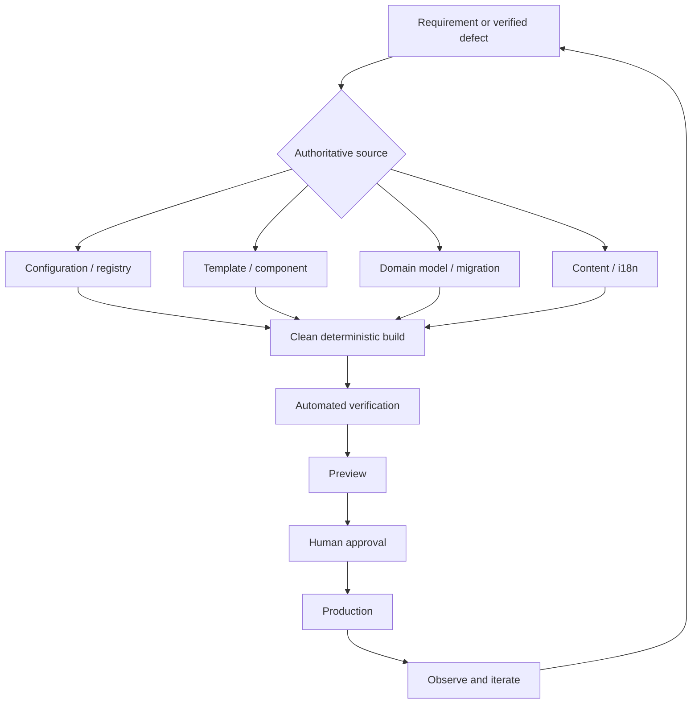
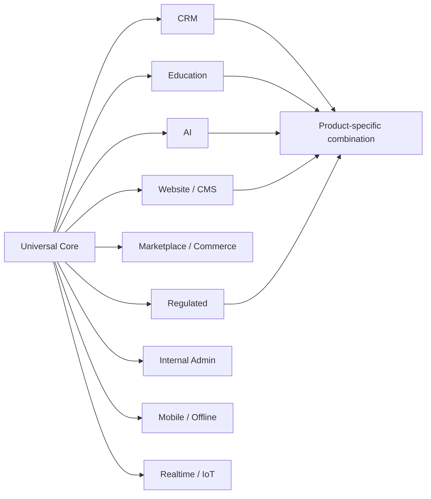
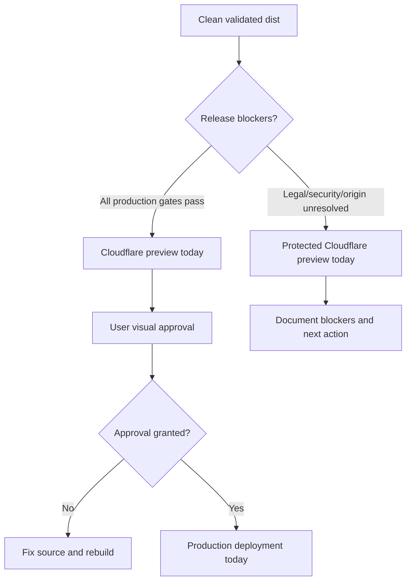
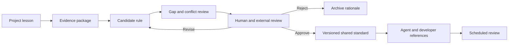

# Candidate Full-Stack Development Hard Rules v0.2
**Status:** Candidate only — not adopted  
**Date:** 2026-09-16  
**Audience:** Hermes development agents, developers, reviewers, product owners, and non-technical AI-assisted builders  
**Permanent standards modified:** No  
**Approval required before adoption:** Yes
## Reading guide
This version turns the earlier broad draft into a layered operating standard. It separates non-negotiable universal rules, proportional rules activated by risk tier, and composable profiles for CRM, education, AI, websites, commerce, mobile, admin, and regulated products.

The central rule is:

> Change the highest authoritative source, generate replaceable outputs, verify the complete affected system, deploy a traceable artefact, and preserve safe evolution after launch.

NIST’s Secure Software Development Framework is intended to integrate secure practices into different software-development lifecycles rather than impose one implementation model. OWASP ASVS supplies verifiable application-security requirements, while W3C recommends WCAG 2.2 for current accessibility work.[^1][^2][^3][^4]
## Normative language
- **MUST:** Release-blocking unless a documented exception is approved.
- **SHOULD:** Default practice; deviation requires a written rationale and verification plan.
- **MAY:** Optional pattern selected when appropriate.
- **PROFILE:** Additional rule activated by product capability, users, data, or regulation.
## Core architecture

## Universal hard rules
### HR-01 — Authoritative source first
Every durable change **MUST** be made at the highest authoritative editable layer: domain model, migration, configuration, registry, content/i18n source, component, template, infrastructure definition, or build script.

Generated HTML, compiled bundles, caches, `dist/`, vendored files, and deployment artefacts **MUST NOT** be permanent editing layers. A diagnostic direct edit is allowed only when labelled as temporary, reproduced in source, rebuilt, verified, and discarded.
### HR-02 — One source of truth
Each changeable concern **MUST** have one declared authoritative source and owner. Routes, permissions, schema, translations, assets, integration endpoints, prices, plans, legal identity, and environment values must not have competing authorities.

Derived copies are acceptable only when generated and replaceable.
### HR-03 — Post-launch evolvability
The first deployment **MUST** be treated as version one, not a frozen artefact. Routes, workflows, fields, roles, integrations, content, languages, assets, policies, and data models must remain centrally changeable without mass manual editing.

Renaming, replacing, splitting, merging, or retiring a page, API, course, workflow, or entity must update its dependencies, compatibility behavior, redirects, metadata, and tests.
### HR-04 — Configuration outside code
Secrets and environment-specific values **MUST** stay outside source code. Required configuration must be validated at build/startup and fail closed when absent. Production must never silently fall back to a placeholder domain, sample tenant, preview host, or development database.
### HR-05 — Explicit boundaries
Presentation, application/service, domain, persistence, integration, and infrastructure responsibilities **MUST** be identifiable. UI visibility never substitutes for backend authorization. Persistence models must not accidentally become the public API contract.

A modular monolith **SHOULD** be preferred over premature microservices unless independent scaling, isolation, ownership, regulation, or deployment needs are demonstrated.
### HR-06 — Contract-first integrations
Every external integration **MUST** define endpoint, authentication, request/response schema, errors, timeout, retry, idempotency, ownership, versioning, and deprecation. OWASP’s API guidance emphasizes object-level authorization, authentication, resource limits, function-level authorization, inventory, and safe consumption of third-party APIs.[^5][^6]
### HR-07 — Versioned migrations
Persistent schema changes **MUST** use reviewable migrations. Destructive changes require compatibility sequencing, backup/restore evidence, and a rollback or roll-forward plan. Manual production schema edits are prohibited except under an approved incident process and must later be captured as migrations.
### HR-08 — Data lifecycle ownership
Sensitive and business-critical data **MUST** have a purpose, owner, access policy, retention period, deletion/export behavior, and backup treatment. Privacy safeguards must be considered before and during processing; this reflects data protection by design and by default.[^7][^8]
### HR-09 — Deny by default
Authentication and authorization **MUST** remain separate. Backend controls enforce tenant, role, object, field, and action boundaries regardless of the interface. New privileged operations default to denied.
### HR-10 — Secure by design
Threat modelling and abuse-case review **MUST** precede sensitive functionality. Security may not be deferred as a premium feature or left solely to users; CISA frames secure-by-design as product responsibility.[^9][^10]

Risk-appropriate OWASP ASVS controls **MUST** be used as a verifiable baseline.[^2]
### HR-11 — Secret safety
Credentials, tokens, private keys, signing secrets, production connection strings, and unredacted sensitive data **MUST NOT** appear in chat, prompts, source control, screenshots, fixtures, client bundles, or ordinary logs. Suspected exposure requires rotation. Secret scanning must run before commit and in CI.
### HR-12 — Supply-chain control
Dependencies **MUST** be lockfile-controlled, attributable, scanned, and periodically reviewed. Releases should record dependency state, source commit, and build provenance. OWASP SCVS and SLSA provide complementary controls for component and build integrity.[^11][^12][^13]
### HR-13 — Deterministic clean builds
Build output **MUST** be reproducible from declared source and configuration. Output directories must be deleted and recreated before build so stale files cannot survive. Only an allowlisted artefact may deploy.
### HR-14 — Isolated work and permissions
Agents **MUST** work in isolated branches or equivalent workspaces. They must not push, merge, deploy, create infrastructure, rotate credentials, or modify permanent standards beyond the explicit authorization granted for the task.
### HR-15 — Risk-based testing
Changes **MUST** receive tests at the cheapest reliable layer: unit for domain behavior, integration for boundaries, contract for APIs, and end-to-end for critical journeys. Defect fixes should include regression tests. Failure, permissions, empty/loading/error, retry, responsive, and locale states are included when applicable.
### HR-16 — Honest validation scope
Reports **MUST** state both result and denominator. A statement such as “25/25 passed” cannot prove completeness if 49 deployable pages exist. Exclusions, skipped checks, and untested variants must be explicit.
### HR-17 — Accessibility by default
User-facing products **MUST** target WCAG 2.2 AA unless stricter requirements apply. W3C advises use of WCAG 2.2 for future applicability. Semantics, keyboard operation, focus, accessible names, reflow, zoom, contrast, target size, reduced motion, errors, captions/transcripts, and assistive-technology testing belong in definition of done.[^4]
### HR-18 — Performance budgets
Each product **MUST** define budgets for relevant client assets, images, API latency, database queries, background jobs, and AI calls. For websites, Core Web Vitals measure loading, interactivity, and visual stability in real user experience.[^14][^15]
### HR-19 — Observability
Production **MUST** expose sufficient structured logs, metrics, traces, health signals, and audit events to identify failures, impact, timing, release, and recovery. OpenTelemetry provides a vendor-neutral framework for telemetry. Observability data must avoid unnecessary personal data and secrets.[^16][^17]
### HR-20 — Safe release and rollback
Preview/staging and production **MUST** be explicit and separate. Every release identifies source commit, build, configuration class, migrations, checks, approver, and destination. Rollback or roll-forward is defined before production.
### HR-21 — Restore-tested backups
A backup **MUST NOT** be accepted as protection until restoration has been tested. Recovery targets must include application data, files, encryption dependencies, required configuration, and tenant boundaries.
### HR-22 — Idempotent side effects
Payments, email, webhooks, documents, enrolment, imports, scheduled jobs, and external writes **MUST** define timeout, retry, duplicate handling, idempotency, and recovery. Incoming webhooks must be authenticated when supported and traceable for replay analysis.
### HR-23 — Explicit state machines
Multi-step workflows **MUST** use declared states and permitted transitions instead of scattered booleans. Sensitive transitions require authorization and audit events.
### HR-24 — Human-centred recovery
Critical flows **MUST** preserve work where safe, explain failures plainly, distinguish validation from system errors, and provide a next action. Stack traces, prompts, database errors, and security internals must never reach users.
### HR-25 — Internationalization architecture
Locales **MUST** share stable content, route, and translation IDs. Generated translations must not become independent hand-edited forks. Validation covers missing keys, links, metadata, formats, legal copy, layout expansion, and language-switch destinations. High-impact copy requires human linguistic review.
### HR-26 — AI-agent discipline
AI-generated code, configuration, migrations, copy, and tests are untrusted proposals until reviewed and verified. Agents must never claim a test, visual review, security correction, or deployment without evidence. Prompts must constrain scope, prohibited actions, source of truth, verification, and stop conditions.
### HR-27 — AI feature safety
AI products activate controls for prompt injection, sensitive-information disclosure, excessive agency, supply-chain risk, data/model poisoning, unbounded consumption, misinformation, hidden-context exposure, vector/embedding weaknesses, and improper output handling.[^18][^19]

AI affecting rights, money, legal position, health, grades, access, publication, or deletion **MUST** have proportional human oversight, provenance, uncertainty communication, and reversibility. NIST AI RMF supports trustworthiness throughout design, development, use, and evaluation.[^20][^21]
### HR-28 — Living documentation
The repository **MUST** document setup, boundaries, configuration, data model, deployment, migrations, integrations, tests, backup/restore, and incident handling. Source and generated outputs must be distinguished. A critical rule stored only in chat or agent memory is not an operational standard.
### HR-29 — Decision and exception records
Significant architecture, security, privacy, data, deployment, dependency, and standards exceptions **MUST** record context, decision, alternatives, trade-offs, owner, expiry/review condition, and evidence. An exception must not silently become precedent.
### HR-30 — Human approval gates
Human approval **MUST** precede production deployment, destructive migration/deletion, publication, billing activation, credential rotation, unapproved remote operations, and shared-standard modification.

A lesson from one implementation cannot become a universal hard rule until evidence, applicability, cost, exceptions, and conflicts are reviewed.
## Advisory rules
- Prefer mature, reversible technology over novelty without demonstrated benefit.
- Prefer modular architecture over distributed complexity without evidence.
- Use progressive disclosure for complex interfaces.
- Use design tokens and reusable components before page-specific exceptions.
- Use stable identifiers independently of display text.
- Activate profiles by capability and risk, not product name.
- Measure outcomes rather than vanity metrics.
- Treat cost as a quality attribute.
- Degrade gracefully when optional AI, analytics, widgets, or integrations fail.
- Assign owners and expiry to flags, adapters, compatibility routes, and temporary infrastructure.
## Risk tiers
| Tier | Meaning | Typical state | Required control level |
|---|---|---|---|
| T0 | Disposable experiment | No real users, real data, publication, or dependency | Source control, secret safety, explicit disposability |
| T1 | Limited prototype | Invited testers, synthetic/low-sensitivity data, no consequential decisions | Core access, data-loss prevention, local tests, preview isolation |
| T2 | Production application | Real users, persistent data, integrations and support obligations | All universal hard rules unless an approved exception exists |
| T3 | High-impact/regulated | Sensitive data, minors, legal/health/financial/education consequences | Universal core plus relevant strict profiles, enhanced evidence and review |

Calling a project a prototype never waives secret safety, authorization boundaries, consent, or protection against irreversible data loss.
## Composable profiles

### CRM profile
CRM products **MUST** add tenant isolation, explicit lifecycle states, immutable sensitive audit history, safe deduplication/merge, schema-driven custom fields, field-level permissions, safe import/export, versioned idempotent integrations, retention/deletion rules, bulk-action safeguards, and source provenance. Public marketing CTAs must remain decoupled from internal superadmin routes.
### Education profile
Learning products **MUST** distinguish completion, mastery, attendance, engagement, and assessment; version courses, lessons, rubrics, questions, and certificates; preserve or deliberately migrate progress; provide accessible alternatives; define AI assistance and academic-integrity rules; protect learners and minors; and keep consequential grading reviewable.

UNESCO recommends human-centred, age-appropriate, privacy-protective, ethically validated use of generative AI in education. Institutional integrations may use LTI, while xAPI supports interoperable communication of learning activities and experiences.[^22][^23][^24][^25]
### AI-assisted non-technical builder profile
Before code changes, the agent **MUST** translate intent into scope, acceptance criteria, risks, prohibited actions, and approval gates. It must map source, generated output, storage, integrations, environments, costs, and deployment targets.

The agent must explain migrations, deletion, authentication, authorization, vendor lock-in, recurring cost, rollback, and data ownership in plain language. “Looks correct” is never sufficient proof for security, privacy, accessibility, migration, or deployment.
### Website and CMS profile
Websites **MUST** centralize page, route, content, asset, locale, redirect, and metadata models. Canonical, hreflang, sitemap, schema, social metadata, and internal links should derive from the same page model. Preview environments must be distinguished from production; generated pages and `dist/` are never permanent edit locations.

Cloudflare Pages preview deployments do not affect custom domains or the main `pages.dev` production URL and receive `X-Robots-Tag: noindex` by default; preview access can additionally be protected with Cloudflare Access.[^26]
### Additional profiles
- **Marketplace/commerce:** monetary precision, price provenance, idempotent payment/stock/refund flows, reconciliation, disputes, actor isolation.
- **Internal admin:** strong authentication, least privilege, protected bulk/export/impersonation actions, auditability.
- **Regulated/legal/health:** classification, decision accountability, legal review, evidence versioning, human responsibility, release gates.
- **Mobile/offline:** sync authority, conflicts, retries, local encryption, revocation, interrupted-network handling, platform accessibility.
- **Realtime/IoT:** event ordering, deduplication, freshness, reconnect, acknowledgement, device credentials, safe failure.
## Deployment decision rule
Before creating deployment infrastructure, choose and record the deployment model. Cloudflare documents Direct Upload for prebuilt assets uploaded locally or by custom CI, while Git-integrated projects support production and preview branch controls.[^27][^28]

A same-day deployment may use Direct Upload when no remote exists, but this operational choice must not weaken source traceability: the deployed artefact still needs a recorded commit, clean build, complete validation, and explicit preview/production classification.

## Agent evidence contract
Every completion report **MUST** state:

- Goal, non-goals, and acceptance criteria.
- Branch/workspace and base commit.
- Authoritative sources changed.
- Generated outputs changed.
- Files intentionally untouched.
- Exact commands actually run.
- Passed, failed, and skipped tests with denominator.
- Activated security, privacy, accessibility, performance, and profile checks.
- Migration, backup, restore, rollback, preview, production, and secrets status.
- Unresolved blockers and trade-offs.
- Confidence supported by evidence.
- Whether a reusable rule is proposed.
- Whether a permanent standard was modified.
## Standards governance

Permanent adoption requires comparison with existing Obsidian, frontend, backend, SEO/AEO/GEO, security, accessibility, deployment, and agent-operation standards. Candidate files must remain outside deployable directories.
## Required pilot validation
Before adoption, test this candidate on:

- LexFlow website plus CRM integration.
- One AI-assisted education application.
- One low-risk prototype to test whether the standard is proportionate.
- One T3 scenario to test whether evidence and release gates are strong enough.
## Unified plan-track-verify-debug table
| Date | Plan | Location | Action taken | Verification | Debug notes / lessons | Status |
|---|---|---|---|---|---|---|
| 2026-09-16 | Consolidate universal principles | HR-01–HR-30 | Refined the previous candidate into source, architecture, data, security, test, operations and governance rules | Pass — mapped to NIST, OWASP, W3C, CISA, SLSA and OpenTelemetry sources | Existing Hermes/Obsidian standards still require inventory comparison | Done |
| 2026-09-16 | Add proportionality | Risk tiers | Added T0–T3 activation model | Needs review — must be tested on a prototype and a regulated scenario | Avoid using “prototype” as an excuse for unsafe secrets or irreversible loss | Needs review |
| 2026-09-16 | Preserve cross-domain flexibility | Composable profiles | Added CRM, Education, AI-builder, Website/CMS and other profiles | Pass — profiles compose instead of forking the universal core | Jurisdiction-specific law remains outside the universal baseline | Done |
| 2026-09-16 | Support same-day LexFlow release without weakening gates | Deployment decision rule | Added preview-first flow and blocker-dependent production path | Pass — aligned with Cloudflare preview and branch documentation | Final ORIGIN, authentication and legal placeholders remain project facts to verify | Done |
| 2026-09-16 | Make standard teachable | Mermaid diagrams and evidence contract | Added editable diagrams and agent reporting structure | Needs review — render Mermaid in target Obsidian/export environment | Keep diagrams text-based for future editing | Needs review |
| 2026-09-16 | Preserve human approval | Status and governance | Marked candidate-only and prohibited automatic permanent integration | Pass — permanent standards modified: No | External review and explicit approval remain mandatory | Done |
## Candidate conclusion
The universal core governs how software is changed, secured, tested, observed, deployed, recovered, and governed. Profiles add domain-specific obligations without fragmenting the standard.

> **Golden candidate rule:** The fewer hard-coded changeable values, the better—but flexibility must come from one authoritative source and a deterministic pipeline, not from unstructured indirection or manual edits.

This document remains a draft. It must be reviewed, tested on multiple product types, reconciled with existing standards, iterated, and explicitly approved before adoption.

---

## References

1. [Secure Software Development Framework | CSRC](https://csrc.nist.gov/Projects/ssdf) - The Secure Software Development Framework (SSDF) is a set of fundamental, sound, and secure software...

2. [OWASP Application Security Verification Standard (ASVS)](https://owasp.org/www-project-application-security-verification-standard/) - Get the latest stable version of the ASVS (5.0.0) from the Downloads page. latest Application Securi...

3. [Secure Software Development Framework (SSDF) Version 1.1: - NIST](https://nvlpubs.nist.gov/nistpubs/SpecialPublications/NIST.SP.800-218.pdf) - This document defines version 1.1 of the Secure Software Development Framework (SSDF) with fundament...

4. [Web Content Accessibility Guidelines (WCAG) 2.2](https://www.w3.org/TR/WCAG22/) - While WCAG 2.0 and WCAG 2.1 remain W3C Recommendations, the W3C advises the use of WCAG 2.2 to maxim...

5. [OWASP API Security Top 10](https://owasp.org/API-Security/editions/2023/en/0x00-header) - OWASP API Security Top 10 2023 edition © Copyright 2023 - OWASP API Security Project team

6. [OWASP API Security Project](https://owasp.org/projects/api-security-project) - API Security Top 10 2023 API Security Top 10 2023 Here is a sneak peek of the 2023 version: API1:202...

7. [Guidelines 4/2019 on Article 25 Data Protection by Design and by ...](https://www.edpb.europa.eu/documents/guideline/guidelines-42019-on-article-25-data-protection-by-design-and-by-default_en) - Guidelines 4/2019 on Article 25 Data Protection by Design and by Default · Guideline · 20 October 20...

8. [[PDF] Guidelines 4/2019 on Article 25 Data Protection by Design and by ...](https://www.edpb.europa.eu/sites/default/files/files/file1/edpb_guidelines_201904_dataprotection_by_design_and_by_default_v2.0_en.pdf) - These Guidelines give general guidance on the obligation of Data Protection by Design and by Default...

9. [Secure by Design - CISA](https://www.cisa.gov/securebydesign) - The guidance offers manufacturers a framework for developing and sharing memory-safe roadmaps, demon...

10. [Secure-by-Design - CISA](https://www.cisa.gov/resources-tools/resources/secure-by-design) - It expands on the three principles which are: Take Ownership of Customer Security Outcomes, Embrace ...

11. [OWASP Software Component Verification Standard](https://owasp.org/www-project-software-component-verification-standard/) - The Software Component Verification Standard (SCVS) is a community-driven effort to establish a fram...

12. [Using the SCVS - OWASP](https://scvs.owasp.org/scvs/using-scvs/) - The Software Component Verification Standard places emphasis on controls that can be implemented or ...

13. [SLSA • Supply-chain Levels for Software Artifacts](https://slsa.dev/) - SLSA is a security framework. It is a check-list of standards and controls to prevent tampering, imp...

14. [Web Vitals | Articles - web.dev](https://web.dev/articles/vitals) - Web Vitals can help you quantify the experience of your site and identify opportunities to improve. ...

15. [Understanding Core Web Vitals and Google search results](https://developers.google.com/search/docs/appearance/core-web-vitals) - Core Web Vitals is a set of metrics that measure real-world user experience for loading performance,...

16. [Documentation - OpenTelemetry](https://opentelemetry.io/docs/) - OpenTelemetry, also known as OTel, is a vendor-neutral open source Observability framework for instr...

17. [What is OpenTelemetry?](https://opentelemetry.io/docs/what-is-opentelemetry/) - OpenTelemetry is: An observability framework and toolkit designed to facilitate the Generation Expor...

18. [OWASP Top 10 for LLM Applications 2025](https://genai.owasp.org/resource/owasp-top-10-for-llm-applications-2025/) - Discover the OWASP Top 10 for LLM Applications (2025) – essential guidance for securing large langua...

19. [GitHub - GenAI-Security-Project/GenAI-LLM-Top10: OWASP Top 10 ...](https://github.com/GenAI-Security-Project/GenAI-LLM-Top10) - This is the official source repository for the OWASP Top 10 for Large Language Model Applications, m...

20. [AI Risk Management Framework - NIST](https://www.nist.gov/itl/ai-risk-management-framework) - AI Risk Management Framework ... On April 7, 2026, NIST released a concept note for an AI RMF Profil...

21. [AI RMF - AIRC - NIST AI Resource Center](https://airc.nist.gov/airmf-resources/airmf/) - The AI RMF Core provides outcomes and actions that enable dialogue, understanding, and activities to...

22. [Learning Tools Interoperability (LTI) - 1EdTech Consortium](https://www.1edtech.org/standards/lti) - 1EdTech's LTI standard is a technical standard (not a product) used to connect learning tools with a...

23. [adlnet/xAPI-Spec: The xAPI Specification describes ... - GitHub](https://github.com/adlnet/xAPI-Spec) - xAPI is a learning technologies interoperability specification that describes communication about le...

24. [Guidance for generative AI in education and research - UNESCO](https://www.unesco.org/en/articles/guidance-generative-ai-education-and-research) - UNESCO's first global guidance on GenAI in education aims to support countries to implement immediat...

25. [Guidance for generative AI in education and research](https://unesdoc.unesco.org/ark:/48223/pf0000386693) - Guidance for generative AI in education and researchThe Global Education 2030 Agenda UNESCO, as the ...

26. [Preview deployments · Cloudflare Pages docs](https://developers.cloudflare.com/pages/configuration/preview-deployments/) - Preview deployments allow you to preview new versions of your project without deploying it to produc...

27. [Direct Upload · Cloudflare Pages docs](https://developers.cloudflare.com/pages/get-started/direct-upload/) - Direct Upload enables you to upload your prebuilt assets to Pages and deploy them to the Cloudflare ...

28. [Branch deployment controls · Cloudflare Pages docs](https://developers.cloudflare.com/pages/configuration/branch-build-controls/) - Production branch control. Direct Upload · Preview branch control. When configuring automatic previe...

