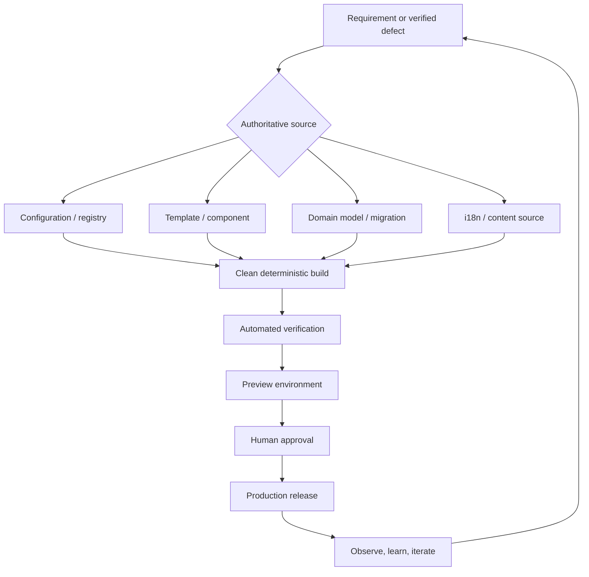
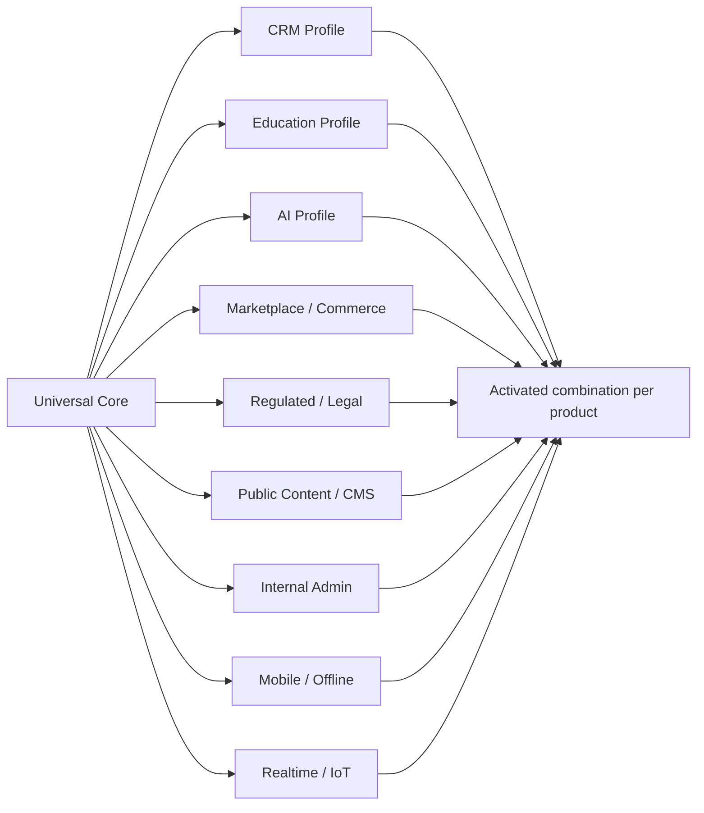
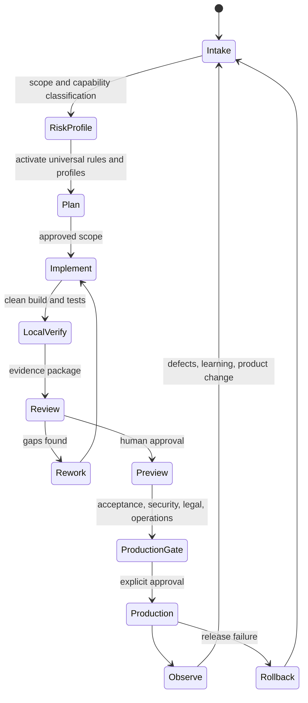
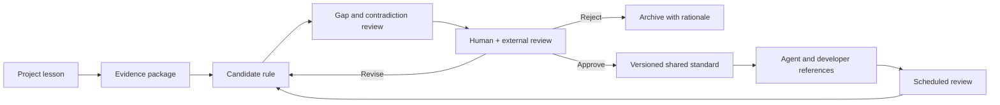

# Candidate Universal Hard Rules for AI-Assisted Full-Stack Development
**Status:** Candidate only — not adopted  
**Audience:** Hermes development agents, AI-assisted developers, reviewers, product owners, and non-technical builders  
**Scope:** Web, mobile, SaaS, CRM, EdTech, marketplaces, e-commerce, portals, content systems, internal tools, API products, AI-enabled products, and regulated applications  
**Version:** Draft 0.1 — 2026-09-16  
**Permanent standards modified:** No  
**Approval required before adoption:** Yes
## Purpose
This document proposes a common engineering baseline for every application built or modified by Hermes development agents. It separates universal rules from product-specific profiles so that a CRM, learning platform, marketplace, mobile app, or AI-enabled service can share the same safety and quality foundation without forcing every product into the same architecture.

The standard is intentionally split into:

- **MUST:** a release-blocking hard rule unless a documented exception is approved.
- **SHOULD:** the default; deviations require a written trade-off and verification plan.
- **MAY:** an optional pattern selected when it fits the product.
- **PROFILE:** additional requirements activated by product type, data sensitivity, users, or regulation.

Security practices must be integrated into the chosen software lifecycle rather than treated as a separate final audit; NIST’s SSDF is designed as a core set of practices that can be incorporated into different SDLC models. Accessibility should target the current WCAG 2.2 Recommendation, while privacy and AI risk should be managed throughout the product lifecycle, not only at launch.[^1][^2][^3][^4][^5]
## Governing principle
> **Change the authoritative source, not its generated consequence. Build every product so it remains safe to change after launch.**

The less changeable information is hard-coded across the codebase, the better. This does not mean “never hard-code anything.” Stable invariants may live in code. Domains, secrets, environment URLs, CTA targets, route mappings, feature flags, asset assignments, role permissions, locale mappings, legal entity data, limits, and product relationships must instead live in the correct centralized source.

## Rule model
Every rule adopted from this draft must eventually include:

- Rule ID and title.
- Requirement level: MUST, SHOULD, MAY, or PROFILE.
- Problem prevented.
- Correct and incorrect patterns.
- Automated verification.
- Human verification.
- Exceptions and approving owner.
- Evidence: file, command, test, screenshot, trace, or commit.
- Applicability: universal or profile-specific.
- Review date and version.
## Universal hard rules
### HR-01 — Authoritative source first
**MUST:** Every durable change must be applied at the highest authoritative editable layer: domain model, migration, configuration, registry, content source, i18n source, component, template, infrastructure definition, or build script.

Generated HTML, compiled bundles, migration output, `dist/`, caches, vendored files, and deployment artefacts must not be the permanent editing layer. A temporary diagnostic edit is allowed only when it is labelled as diagnostic, reproduced in the authoritative source, rebuilt, verified, and discarded.

**Release evidence:** source-to-output map; changed-source list; proof that a clean rebuild preserves the correction.
### HR-02 — One source of truth per concern
**MUST:** Every changeable concern must have one declared owner and one authoritative source. Route definitions, permissions, schema, product copy, translations, assets, integration endpoints, plans, prices, and legal identity must not have competing authorities.

Duplication may exist in generated output, caches, indexes, or read models, but those copies must be derived and replaceable. The system must document which copy wins when sources disagree.
### HR-03 — Post-launch evolvability
**MUST:** The first production release is version one, not a frozen artefact. The product must support controlled changes to routes, workflows, roles, fields, integrations, copy, languages, assets, policies, and data models without mass manual editing.

A change to an external CRM URL, course relationship, product category, page route, or image assignment should propagate from a registry or model through a deterministic pipeline. If a page or API is renamed, merged, split, or retired, dependent navigation, deep links, clients, metadata, redirects, and tests must be updated together.
### HR-04 — Separate stable code from variable configuration
**MUST:** Environment-specific values and secrets must be outside source code. Required configuration must be validated at startup or build time and fail closed with a clear error when absent.

The Twelve-Factor methodology recommends separating configuration from code, while NIST and CISA guidance reinforces integrating security into design and delivery. No production default may silently point to a placeholder, preview host, sample tenant, or development database.[^6][^7]
### HR-05 — Explicit architecture boundaries
**MUST:** The project must identify its presentation, application/service, domain, data, integration, and infrastructure boundaries. UI code must not become the only location for business rules; transport handlers must not bypass authorization; persistence models must not silently define the public API.

**SHOULD:** Use the simplest architecture that preserves these boundaries. A modular monolith is acceptable and often preferable to premature microservices.
### HR-06 — Contract-first integration
**MUST:** Every external or cross-module integration must have a versioned contract: endpoint, authentication, request/response schema, error behavior, timeout, retry policy, idempotency expectation, ownership, and deprecation plan.

APIs require object-level and function-level authorization, resource limits, inventory, and safe handling of third-party responses; these concerns are central to OWASP’s API Security guidance.[^8][^9]
### HR-07 — Database changes are migrations
**MUST:** Persistent schema changes must use versioned, reviewable migrations. Destructive migrations require backup/restore evidence, compatibility planning, and an approved rollback or roll-forward procedure.

**MUST:** Deployments that change both code and schema must define ordering and backward compatibility. Manual production schema edits are prohibited except for an approved incident procedure that is subsequently captured as a migration.
### HR-08 — Data lifecycle ownership
**MUST:** Every personal, confidential, regulated, or business-critical field must have an owner, purpose, lawful or business basis where applicable, retention period, deletion/export behavior, access policy, and backup treatment.

Privacy must be designed before and during processing, with recurring review of safeguards; EDPB guidance treats data protection by design and by default as an ongoing obligation. The NIST Privacy Framework is technology- and sector-agnostic and can be used to identify and manage privacy risk.[^4][^10][^11]
### HR-09 — Deny by default
**MUST:** Authentication proves identity; authorization separately decides whether that identity may perform a specific action on a specific resource. Backend authorization must enforce tenant, role, object, field, and action boundaries regardless of what the UI hides.

**MUST:** New permissions, routes, resources, and administrative operations default to denied until explicitly granted and tested.
### HR-10 — Secure by design and default
**MUST:** Threat modelling and abuse-case review occur before implementing sensitive flows. Security controls cannot be postponed as a premium feature or left entirely to users; CISA’s Secure by Design guidance treats customer security as a core business requirement.[^6][^12]

**MUST:** Use OWASP ASVS as the verifiable application-security baseline appropriate to product risk; ASVS 5.0.0 is the current stable release identified by OWASP.[^13][^14]
### HR-11 — Secret safety
**MUST:** Tokens, private keys, passwords, credentials, signing secrets, production connection strings, and unredacted personal data must never appear in chat, prompts, source control, client bundles, screenshots, test fixtures, or ordinary logs.

Potentially exposed secrets must be rotated, not merely deleted. Secret scanning must run before commit and in CI. Agents must never invent or reuse production credentials for local testing.
### HR-12 — Dependency and supply-chain control
**MUST:** Dependencies must be pinned or lockfile-controlled, attributable, scanned, and periodically reviewed. Builds must record the source commit and dependency state.

OWASP SCVS emphasizes inventory, SBOM, build environment, package management, component analysis, and provenance, while SLSA supplies incrementally adoptable controls for build integrity.[^15][^16][^17]

**SHOULD:** Produce an SBOM and build provenance for releases. Unmaintained or unnecessary dependencies should be removed rather than accepted indefinitely.
### HR-13 — Deterministic clean builds
**MUST:** Build output must be reproducible from declared source and configuration. The build must clean the output directory before generation so deleted files cannot survive as stale artefacts.

**MUST:** Source, generated output, deployment output, backups, fixtures, and local probes must be distinguishable. Only an allowlisted artefact may be deployed.
### HR-14 — Isolated change workflow
**MUST:** Agents work on an isolated branch or equivalent isolated workspace. They must not push, merge, publish, deploy, create infrastructure, rotate production resources, or alter permanent standards without the user’s explicit permission.

**MUST:** The change package identifies the base commit, changed files, generated files, migrations, configuration changes, and operational actions.
### HR-15 — Risk-based test pyramid
**MUST:** Every change receives tests at the cheapest reliable layer: unit tests for domain behavior, integration tests for boundaries, contract tests for APIs, and end-to-end tests for critical user journeys.

**MUST:** A defect fix includes a regression test when practical. Tests must cover failure paths, authorization boundaries, empty/loading/error states, concurrency or retry behavior where relevant, and locale/responsive variants where relevant.
### HR-16 — Complete validation scope
**MUST:** Validation claims must state denominator and scope. “25/25 endpoints passed” is insufficient if the deployment contains 49 pages. Reports must identify what was tested, what was excluded, and why.

**MUST:** Generated variants—locales, tenants, roles, themes, device classes, plans, feature flags—must be sampled or exhaustively checked according to risk. High-risk permission and data-isolation combinations require exhaustive automated coverage.
### HR-17 — Accessibility by default
**MUST:** User-facing products target WCAG 2.2 AA unless a stricter obligation applies. W3C recommends WCAG 2.2 for future applicability, covering visual, auditory, motor, speech, cognitive, language, learning, and neurological access needs.[^3]

**MUST:** Semantic structure, keyboard operation, visible focus, accessible names, error identification, reflow, zoom, contrast, target size, reduced motion, captions/transcripts, and assistive-technology checks are part of definition of done—not a post-launch patch.
### HR-18 — Performance budgets
**MUST:** Each product defines budgets for client JavaScript, images, fonts, API latency, database queries, and critical journeys. Regressions beyond budget fail CI or require explicit approval.

For web products, the recommended Core Web Vitals targets are LCP within 2.5 seconds, INP at or below 200 ms, and CLS at or below 0.1 at the 75th percentile, evaluated separately for mobile and desktop.[^18][^19]
### HR-19 — Observable operations
**MUST:** Production systems expose enough structured logs, metrics, traces, health signals, and audit events to answer: what failed, who or what was affected, when it began, which release introduced it, and whether recovery worked.

OpenTelemetry provides a vendor-neutral model for generating, collecting, and exporting traces, metrics, and logs. Logs must be useful but must not leak secrets or unnecessary personal data.[^20][^21]
### HR-20 — Safe releases and rollback
**MUST:** Preview/staging and production are explicit, separate environments. A release must identify source commit, build, configuration class, migrations, checks, approver, and destination.

**MUST:** Define rollback or roll-forward before production changes. Feature flags must have owners, expiry dates, secure defaults, and cleanup tasks. Rollback must not assume that a destructive database migration can be reversed safely.
### HR-21 — Backup and restore proof
**MUST:** A backup is not accepted as protection until restoration has been tested. Products must define recovery-point and recovery-time objectives appropriate to their impact.

**MUST:** Restore tests must include application data, uploaded files, encryption dependencies, configuration needed to recover, and tenant boundaries.
### HR-22 — Idempotent and resilient side effects
**MUST:** Payments, email, webhook processing, document generation, enrolment, imports, scheduled jobs, and external writes must define duplicate handling. Retries require bounded backoff, timeout, idempotency, and dead-letter or manual-recovery behavior.

**MUST:** Incoming webhooks must be authenticated where supported, stored or traced sufficiently for replay analysis, and processed so duplicate delivery does not create duplicate business effects.
### HR-23 — Explicit state machines
**MUST:** Multi-step business workflows must use declared states and permitted transitions rather than scattered booleans. Examples include CRM leads, legal matters, enrolments, submissions, orders, payments, approvals, and publishing.

Transition logic belongs in a domain or application layer, is authorization-aware, and emits an audit event for sensitive changes.
### HR-24 — Human-centred error recovery
**MUST:** Critical flows preserve user work where safe, explain what happened in plain language, distinguish validation from system failure, and provide a next action. Internal stack traces, model prompts, database errors, and security details must never be exposed to users.

**SHOULD:** Destructive actions offer confirmation proportional to risk and, when feasible, undo, soft-delete, version history, or recovery windows.
### HR-25 — Internationalization as data architecture
**MUST:** Locales share stable content, route, and translation identifiers. Generated translations must never become independent hand-edited forks unless the governance model explicitly makes them authoritative.

**MUST:** Locale parity checks cover missing keys, links, metadata, structured data, date/number/currency formats, legal text ownership, layout expansion, and language-switch destinations. Human linguistic review is mandatory for high-impact and legal copy.
### HR-26 — AI agent change discipline
**MUST:** AI-generated code, configuration, migrations, copy, and tests are untrusted proposals until reviewed and verified. Agents must not claim a test was run, a page was viewed, a vulnerability was fixed, or a deployment succeeded without evidence.

**MUST:** Prompts must constrain scope, prohibited actions, authoritative sources, verification, and stop conditions. Agents should report concise engineering rationale—observation, assumption, root cause, impact, correction, prevention, and evidence—rather than hidden chain-of-thought.
### HR-27 — AI feature safety
**PROFILE—AI:** Products using LLMs or autonomous tools must address prompt injection, sensitive-information disclosure, excessive agency, supply-chain risk, data/model poisoning, unbounded consumption, misinformation, hidden-context exposure, vector/embedding weaknesses, and improper output handling, matching the current OWASP GenAI risk taxonomy.[^22]

**MUST:** AI output that can affect rights, money, legal position, health, grades, access, publication, or data deletion requires appropriate human oversight, provenance, uncertainty communication, and reversible actions. NIST AI RMF is intended to integrate trustworthiness into design, development, use, and evaluation.[^5][^23]
### HR-28 — Documentation travels with the system
**MUST:** The repository contains concise current documentation for local setup, architecture boundaries, configuration contract, data model, deployment, migrations, integrations, testing, backup/restore, and incident response.

**MUST:** Documentation names authoritative sources and generated outputs. Diagrams must be maintainable text where feasible. A critical rule that exists only in chat or one agent’s memory is not an operational rule.
### HR-29 — Decision and exception records
**MUST:** Significant architecture, security, privacy, data, dependency, deployment, and standards exceptions receive a concise decision record: context, decision, alternatives, trade-offs, owner, expiry/review condition, and evidence.

An exception cannot silently become precedent. Time-limited debt must have an owner and a scheduled removal or reassessment date.
### HR-30 — Human approval gates
**MUST:** Human approval is required before production deployment, destructive migration, permanent deletion, external publication, billing activation, credential rotation, remote creation/push when not pre-authorized, or modification of shared standards.

A candidate rule learned from one project must not become universal until its evidence, generality, cost, contradictions, and exceptions are reviewed.
## Advisory engineering rules
### AR-01 — Prefer boring, reversible technology
**SHOULD:** Select the simplest mature stack that meets present constraints. Adopt a complex framework, distributed architecture, vector database, event bus, or AI agent only when its benefit and operating cost are documented.
### AR-02 — Modular monolith before microservices
**SHOULD:** Start with clear in-process modules unless independent scaling, isolation, ownership, regulation, or deployment cadence proves a service boundary is needed. Module contracts should make later extraction possible without paying distributed-systems costs immediately.
### AR-03 — Progressive disclosure for complexity
**SHOULD:** Keep the common path simple while making advanced capability discoverable. Do not remove necessary professional control merely to make a screen visually minimal.
### AR-04 — Design system before page exceptions
**SHOULD:** Reusable tokens, primitives, components, state patterns, accessibility behavior, and responsive rules should precede page-specific CSS. Exceptions must be named and justified instead of silently overriding the system.
### AR-05 — Stable identifiers over display text
**SHOULD:** Domain entities, content blocks, courses, permissions, fields, routes, and analytics events use stable IDs independent of user-facing labels. This permits renaming and translation without breaking data or integrations.
### AR-06 — Capability-based profiles
**SHOULD:** Activate requirements by capability and risk—not by marketing label. For example, a “simple learning app” that handles minors, payment, AI tutoring, and certificates activates Education, Minor Data, Payments, AI, and Credential profiles.
### AR-07 — Measure outcomes, not vanity
**SHOULD:** Product analytics tie to user outcomes and operational health. Avoid collecting data with no decision purpose. Analytics must respect consent, minimization, retention, and access requirements.
### AR-08 — Cost is a quality attribute
**SHOULD:** Track cost drivers such as AI tokens, storage, egress, email/SMS, background jobs, image transformation, third-party APIs, and database growth. Set rate limits and anomaly alerts before a usage spike becomes an outage or financial incident.
### AR-09 — Graceful degradation
**SHOULD:** Critical content and workflows remain understandable when optional JavaScript, AI, analytics, external widgets, or non-critical integrations fail. The system should communicate degraded capability rather than masquerade as success.
### AR-10 — Sunset what is temporary
**SHOULD:** Feature flags, compatibility routes, duplicate fields, fallback models, preview hosts, test accounts, and transitional adapters need an owner and deletion criterion.
## Application profiles

Profiles compose. They do not replace the universal core.
### CRM profile
Activate for contact, lead, account, case, matter, pipeline, sales, service, or relationship-management systems.

**MUST:**

- Define tenant isolation and test cross-tenant access at API and data layers.
- Model lifecycle states and permitted transitions explicitly.
- Keep immutable audit history for sensitive field, assignment, stage, consent, and permission changes.
- Define deduplication and merge behavior without silently losing history.
- Make custom fields schema-driven, validated, permission-aware, searchable where required, and migration-safe.
- Separate role permissions from UI visibility.
- Define import/export mappings, dry-run validation, partial-failure behavior, and rollback.
- Version webhook and integration contracts; apply idempotency and replay controls.
- Define retention and deletion across contacts, messages, files, activities, backups, and integrations.
- Keep website CTA destinations and public forms decoupled from internal superadmin routes.

**SHOULD:**

- Provide saved views, stable filters, bulk-action previews, undo where feasible, and explain why records appear in a view.
- Preserve field provenance: human entry, import, integration, automation, or AI suggestion.
- Track SLA clocks and automation with timezone-safe rules.
### Education and learning profile
Activate for courses, tutoring, assessment, certification, learning communities, teacher tools, and AI-assisted learning.

**MUST:**

- Define measurable learning outcomes before content and gamification mechanics.
- Separate completion, mastery, attendance, engagement, and assessment; do not treat them as interchangeable.
- Version courses, lessons, rubrics, questions, and certificates so historical learner records remain interpretable.
- Preserve learner progress through content updates or document the migration policy.
- Provide accessible alternatives for video, audio, drag-and-drop, timed tasks, charts, and interactive exercises.
- Define academic-integrity policy, allowed AI assistance, authorship expectations, and appeal/review paths.
- Protect learner data; apply age-appropriate consent and safeguards when minors may use the product.
- Validate AI-generated educational content for accuracy, bias, age appropriateness, pedagogical value, and foreseeable harm. UNESCO recommends human-centred, age-appropriate, privacy-protecting and ethically validated GenAI use in education.[^24][^25]
- Prevent AI tutoring from representing uncertain output as authoritative fact; expose sources or verification paths where appropriate.
- Keep assessment decisions and consequential grading reviewable by authorized humans.

**SHOULD:**

- Use interoperable standards when institutional integration is required. LTI 1.3 provides a standardized and more secure model for connecting external learning tools, while xAPI describes interoperable communication of learning activity and experience data.[^26][^27]
- Support low-bandwidth use, resumable learning, offline-friendly content where needed, and downloadable accessible materials.
- Give learners an understandable progress model and educators transparent evidence—not opaque engagement scores.
- Include AI literacy appropriate to users’ knowledge and context; EU guidance emphasizes context- and role-sensitive AI literacy rather than a one-size-fits-all level.[^28][^29]
### Marketplace and commerce profile
**MUST:**

- Model money with explicit currency and integer minor units or an appropriate decimal type; never binary floating point.
- Keep price, tax, fee, discount, refund, payout, and exchange-rate provenance.
- Make checkout, payment webhooks, stock reservation, refunds, and fulfilment idempotent.
- Separate seller, buyer, operator, support, and finance permissions.
- Define dispute, cancellation, partial fulfilment, chargeback, and reconciliation states.
- Never treat client-side price or entitlement data as authoritative.
### Public website, CMS, and content profile
**MUST:**

- Maintain route, content, asset, locale, redirect, and metadata registries or equivalent authoritative models.
- Generate canonical, alternate-language, sitemap, structured data, social metadata, and internal links from the same page model.
- Preserve old URLs through deliberate redirects when content moves.
- Prevent orphan pages and test all deployed pages, not a partial unexplained sample.
- Keep master assets replaceable while generating optimized derivatives.
- Mark preview environments as non-indexable and distinguish them from production.
- Never permanently edit generated pages or deployment output.
### Internal admin and back-office profile
**MUST:**

- Require strong authentication and least privilege.
- Protect bulk, impersonation, export, role, deletion, and configuration actions with step-up controls appropriate to risk.
- Log who changed what, when, why, and from which authorized context.
- Make impersonation visible, bounded, attributable, and terminable.
- Prevent sensitive actions from depending only on hidden navigation or obscure URLs.
### Regulated, legal, health, and high-impact profile
**MUST:**

- Establish data classification, decision ownership, auditability, retention, legal review, and incident escalation before launch.
- Keep human responsibility for consequential advice and decisions.
- Separate factual source material, AI-generated interpretation, professional approval, and client-visible output.
- Preserve versioned evidence and chain of custody where relevant.
- Treat unresolved legal identity, privacy, consent, or disclosure placeholders as production blockers.
### Mobile and offline profile
**MUST:**

- Define synchronization ownership, conflict resolution, retry, local encryption, logout cleanup, and remote revocation.
- Assume interrupted networks, background suspension, duplicate submission, clock differences, and partial sync.
- Keep touch targets, dynamic text, orientation, keyboard/accessibility services, and platform conventions within definition of done.
- Do not store long-lived secrets or unrestricted sensitive datasets in the client.
### Realtime, device, and IoT profile
**MUST:**

- Define event ordering, deduplication, time semantics, offline behavior, reconnect, stale-data indicators, and command acknowledgement.
- Authenticate devices and support credential rotation and revocation.
- Separate telemetry from authoritative state and display freshness clearly.
- Fail safely when control messages, sensors, or network connectivity are unreliable.
### AI-assisted builder profile
Activate whenever non-technical specialists use AI to build or modify software.

**MUST:**

- Translate the user’s intent into a written scope, acceptance criteria, risks, and prohibited actions before code changes.
- Keep an explicit map of source, generated output, data stores, integrations, environments, and deployment targets.
- Require the agent to show changed files, commands, tests, unresolved failures, and confidence evidence.
- Never accept “looks correct” as the only proof for security, data, accessibility, migration, or deployment claims.
- Use preview data and non-production credentials; protect the user from accidental infrastructure and billing actions.
- Require plain-language explanations of migration, deletion, security, cost, lock-in, and rollback consequences.
- Pause for human approval at high-impact gates.

**SHOULD:**

- Provide key technical terms in English with Russian and Italian equivalents where the user’s learning workflow requires it.
- Maintain a learning log: concept, applied example, mistake, fix, reusable rule, and source.
- Prefer transparent scaffolding and documented code over no-code lock-in that prevents export, testing, or ownership.
## Product activation matrix
| Product capability | Required profiles | Typical additional gates |
|---|---|---|
| Legal CRM with public website | Universal + CRM + Regulated + Public Content | Legal copy, tenant isolation, audit history, secure public-to-CRM integration |
| AI learning platform for adults | Universal + Education + AI + AI-assisted Builder | Pedagogical validation, AI disclosure, assessment oversight, model-cost limits |
| Learning app for minors | Universal + Education + AI if used + Mobile if applicable | Age assurance, guardian/consent model, strict minimization, content safety |
| Marketplace | Universal + Marketplace + Public Content | Payment reconciliation, seller isolation, disputes, fraud/abuse controls |
| Internal analytics dashboard | Universal + Internal Admin | Field-level authorization, export controls, data freshness, audit logs |
| Multilingual marketing site | Universal + Public Content | Locale parity, redirects, crawlability, preview noindex, full-link audit |
| Mobile field-service CRM | Universal + CRM + Mobile/Offline | Conflict resolution, device security, sync recovery, offline permissions |
| AI document assistant | Universal + AI + applicable domain profile | Source attribution, retrieval isolation, prompt-injection defence, human approval |
## Delivery lifecycle

### Mandatory stage gates
1. **Intake:** define user outcome, non-goals, constraints, data, integrations, and acceptance criteria.
2. **Risk profile:** activate relevant profiles and identify consequential actions.
3. **Plan:** map authoritative sources, files, migrations, tests, rollback, and prohibited actions.
4. **Implementation:** make surgical changes only in approved scope.
5. **Local verification:** clean build; tests; static analysis; dependency, secret, accessibility, and link checks as applicable.
6. **Evidence review:** present exact commands, changed files, failures, screenshots where meaningful, and unresolved risk.
7. **Preview:** deploy only with explicit permission; isolate data and prevent unintended indexing.
8. **Production gate:** human approval plus legal, security, data, migration, backup, observability, and rollback readiness.
9. **Operate:** monitor, respond, learn, and feed verified lessons back into the next change.
## Verification contract
Every agent completion report must state:

- Goal and acceptance criteria.
- Branch/workspace and base commit.
- Authoritative sources changed.
- Generated outputs changed.
- Files intentionally not changed.
- Commands actually run.
- Tests: passed, failed, skipped, and denominator.
- Security/privacy/accessibility/performance checks activated.
- Data migration and rollback status.
- Preview/production status.
- Secrets exposure status.
- Unresolved blockers and trade-offs.
- Confidence score with evidence, not intuition.
- Whether a new reusable rule is proposed.
- Whether any permanent standard was modified.
## Standards governance

A project lesson is not automatically a universal hard rule. Candidate rules must be checked against existing standards, applicable product types, operating costs, exceptions, and contradictory controls. Permanent standards must be versioned, owned, linked to evidence, and reviewable.
## Key glossary
| English | Russian | Italian | Working meaning |
|---|---|---|---|
| Source of truth | источник истины | fonte autorevole | The declared authoritative editable source |
| Generated artefact | сгенерированный артефакт | artefatto generato | Replaceable output produced from source |
| Build pipeline | конвейер сборки | pipeline di build | Repeatable process from source to deployable output |
| Regression test | регрессионный тест | test di regressione | Test preventing a fixed defect from returning |
| Rollback | откат | ripristino | Return to a previously safe release/state |
| Idempotency | идемпотентность | idempotenza | Repeating an operation does not duplicate its business effect |
| Least privilege | минимальные привилегии | privilegio minimo | Grant only the access required for the task |
| Threat model | модель угроз | modello delle minacce | Structured analysis of likely abuse and defenses |
| Observability | наблюдаемость | osservabilità | Ability to understand system behavior through telemetry |
| Data minimization | минимизация данных | minimizzazione dei dati | Collect and retain only data necessary for a defined purpose |
| Progressive disclosure | прогрессивное раскрытие | divulgazione progressiva | Show complexity only when the user needs it |
| Human-in-the-loop | человек в контуре | supervisione umana | Human review or control over consequential automation |
## Adoption checklist
Before this draft can become a shared Hermes standard:

- Compare it with existing Obsidian, frontend, backend, SEO/AEO/GEO, security, accessibility, deployment, and agent-operation rules.
- Remove duplicate or contradictory instructions.
- Validate MUST rules against low-risk prototypes so the standard does not prohibit efficient experimentation.
- Define named exceptions for prototypes, demos, static sites, offline tools, and high-assurance products.
- Add stack-specific appendices only after the technology is selected.
- Test the reporting contract on LexFlow and at least one education application.
- Review terminology with non-technical builders.
- Validate Mermaid diagrams in the target Markdown/Obsidian renderer.
- Assign owner, version, review cadence, and change process.
- Obtain explicit user approval before updating any permanent standard or agent profile.
## Unified plan-track-verify-debug table
| Date | Plan | Location (marker/section) | Action taken | Verification | Debug notes / lessons | Status |
|---|---|---|---|---|---|---|
| 2026-09-16 | Define universal baseline | HR-01–HR-30 | Drafted mandatory rules for source, architecture, data, security, delivery, AI and governance | Pass — structural review against NIST SSDF, OWASP, W3C, NIST Privacy/AI, CISA, SLSA and OpenTelemetry sources | Candidate wording still requires cross-check against existing Hermes/Obsidian rules | Done |
| 2026-09-16 | Add broad product coverage | Application profiles | Added CRM, Education, Marketplace, Content, Admin, Regulated, Mobile, Realtime, AI and AI-assisted-builder profiles | Pass — capability activation matrix confirms profiles can compose | Industry-specific legal obligations remain jurisdiction-dependent | Done |
| 2026-09-16 | Improve learnability | Governing principle; diagrams; glossary | Added three Mermaid diagrams and EN/RU/IT key terminology | Needs review — diagrams must be rendered in the user’s Obsidian environment | Mermaid support may vary by renderer; keep diagrams as editable text | Needs review |
| 2026-09-16 | Preserve approval gate | Status; Standards governance; Adoption checklist | Marked document candidate-only and prohibited automatic permanent adoption | Pass — explicit status and adoption checklist included | No Obsidian standards were searched or modified in this drafting session | Done |
| 2026-09-16 | Prepare Hermes application | Verification contract | Defined evidence required from every agent completion | Needs review — test against LexFlow and one EdTech application | Requirements may need risk-tier calibration after pilots | Pending |
## Candidate conclusion
The universal core should define how software is changed, secured, tested, observed, deployed, recovered, and governed. Product profiles should add domain-specific obligations without forking the core standard.

> **Golden candidate rule:** Change the highest authoritative source; generate replaceable outputs; verify the complete affected system; deploy only traceable artefacts; and preserve the ability to evolve safely after launch.

This draft is not a permanent hard rule. It must be tested on LexFlow and an education-product case, compared with existing Obsidian standards, reviewed for overreach and omissions, and explicitly approved before adoption.

---

## References

1. [Secure Software Development Framework | CSRC](https://csrc.nist.gov/Projects/ssdf) - The Secure Software Development Framework (SSDF) is a set of fundamental, sound, and secure software...

2. [Secure Software Development Framework (SSDF) Version 1.1: - NIST](https://nvlpubs.nist.gov/nistpubs/SpecialPublications/NIST.SP.800-218.pdf) - This document defines version 1.1 of the Secure Software Development Framework (SSDF) with fundament...

3. [Web Content Accessibility Guidelines (WCAG) 2.2](https://www.w3.org/TR/WCAG22/) - While WCAG 2.0 and WCAG 2.1 remain W3C Recommendations, the W3C advises the use of WCAG 2.2 to maxim...

4. [Privacy Framework - NIST](https://www.nist.gov/privacy-framework) - The NIST Privacy Framework (PF) is a voluntary tool developed in collaboration with stakeholders int...

5. [AI Risk Management Framework - NIST](https://www.nist.gov/itl/ai-risk-management-framework) - AI Risk Management Framework ... On April 7, 2026, NIST released a concept note for an AI RMF Profil...

6. [Secure by Design - CISA](https://www.cisa.gov/securebydesign) - The guidance offers manufacturers a framework for developing and sharing memory-safe roadmaps, demon...

7. [The Twelve-Factor App](https://12factor.net/) - The twelve-factor app is a methodology for building software-as-a-service apps that: Use declarative...

8. [API Top 10 - OWASP Developer Guide](https://devguide.owasp.org/en/07-training-education/07-api-top-ten/) - The OWASP API Security Project (API Top 10) explains strategies and solutions to help the understand...

9. [OWASP API Security Project | OWASP Foundation](https://owasp.github.io/www-project-api-security/) - Main Acknowledgments Join News RoadMap Translations OWASP API Security Project Check out the new OWA...

10. [[PDF] NIST CSWP 40 Initial Public Draft, NIST Privacy Framework 1.1](https://nvlpubs.nist.gov/nistpubs/CSWP/NIST.CSWP.40.ipd.pdf) - The NIST Privacy Framework 1.1 is a voluntary tool developed in collaboration with stakeholders inte...

11. [[PDF] Guidelines 4/2019 on Article 25 Data Protection by Design and by ...](https://www.edpb.europa.eu/sites/default/files/files/file1/edpb_guidelines_201904_dataprotection_by_design_and_by_default_v2.0_en.pdf) - These Guidelines give general guidance on the obligation of Data Protection by Design and by Default...

12. [Secure-by-Design - CISA](https://www.cisa.gov/resources-tools/resources/secure-by-design) - It expands on the three principles which are: Take Ownership of Customer Security Outcomes, Embrace ...

13. [OWASP Application Security Verification Standard (ASVS)](https://owasp.org/www-project-application-security-verification-standard/) - Get the latest stable version of the ASVS (5.0.0) from the Downloads page. latest Application Securi...

14. [OWASP/ASVS: Application Security Verification Standard - GitHub](https://github.com/owasp/asvs) - Following the release of ASVS 4.0 in 2019 and its minor update (v4.0.3) in 2021, Version 5.0 represe...

15. [Using the SCVS - OWASP](https://scvs.owasp.org/scvs/using-scvs/) - The Software Component Verification Standard places emphasis on controls that can be implemented or ...

16. [SLSA • Supply-chain Levels for Software Artifacts](https://slsa.dev/) - SLSA is a security framework. It is a check-list of standards and controls to prevent tampering, imp...

17. [SLSA - Open Source Security Foundation](https://openssf.org/projects/slsa/) - Supply-chain Levels for Software Artifacts, or SLSA (“salsa”), is a set of incrementally adoptable g...

18. [Web Vitals | Articles - web.dev](https://web.dev/articles/vitals) - Web Vitals can help you quantify the experience of your site and identify opportunities to improve. ...

19. [Understanding Core Web Vitals and Google search results](https://developers.google.com/search/docs/appearance/core-web-vitals) - Core Web Vitals is a set of metrics that measure real-world user experience for loading performance,...

20. [Documentation - OpenTelemetry](https://opentelemetry.io/docs/) - OpenTelemetry, also known as OTel, is a vendor-neutral open source Observability framework for instr...

21. [What is OpenTelemetry?](https://opentelemetry.io/docs/what-is-opentelemetry/) - OpenTelemetry is: An observability framework and toolkit designed to facilitate the Generation Expor...

22. [GitHub - GenAI-Security-Project/GenAI-LLM-Top10: OWASP Top 10 ...](https://github.com/GenAI-Security-Project/GenAI-LLM-Top10) - This is the official source repository for the OWASP Top 10 for Large Language Model Applications, m...

23. [AI RMF - AIRC - NIST AI Resource Center](https://airc.nist.gov/airmf-resources/airmf/) - The AI RMF Core provides outcomes and actions that enable dialogue, understanding, and activities to...

24. [Guidance for generative AI in education and research - UNESCO](https://www.unesco.org/en/articles/guidance-generative-ai-education-and-research) - UNESCO's first global guidance on GenAI in education aims to support countries to implement immediat...

25. [Guidance for generative AI in education and research](https://unesdoc.unesco.org/ark:/48223/pf0000386693) - Guidance for generative AI in education and researchThe Global Education 2030 Agenda UNESCO, as the ...

26. [Learning Tools Interoperability (LTI) - 1EdTech Consortium](https://www.1edtech.org/standards/lti) - 1EdTech's LTI standard is a technical standard (not a product) used to connect learning tools with a...

27. [adlnet/xAPI-Spec: The xAPI Specification describes ... - GitHub](https://github.com/adlnet/xAPI-Spec) - xAPI is a learning technologies interoperability specification that describes communication about le...

28. [AI talent, skills and literacy | Shaping Europe’s digital future](https://digital-strategy.ec.europa.eu/en/policies/ai-talent-skills-and-literacy) - To increase the EU citizen's understanding of AI, the Action Plan underlines the importance of raisi...

29. [AI Literacy - Questions & Answers | Shaping Europe’s digital ...](https://digital-strategy.ec.europa.eu/en/faqs/ai-literacy-questions-answers) - Commission’s activities in relation to Article 4 of the AI Act can be found on the dedicated webpage...

